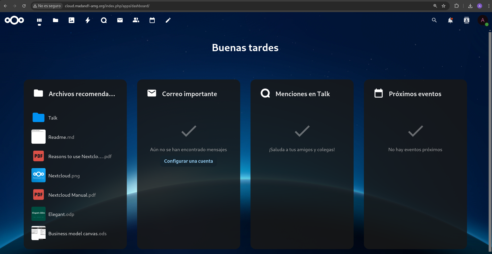
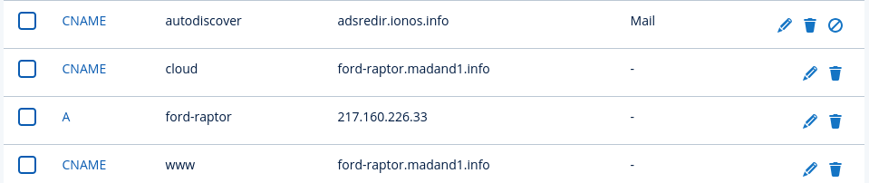
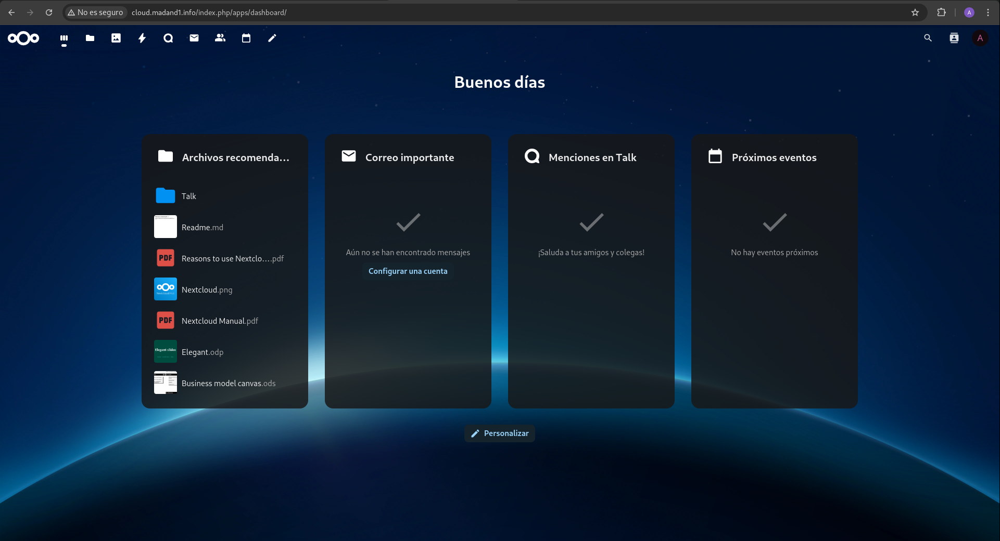
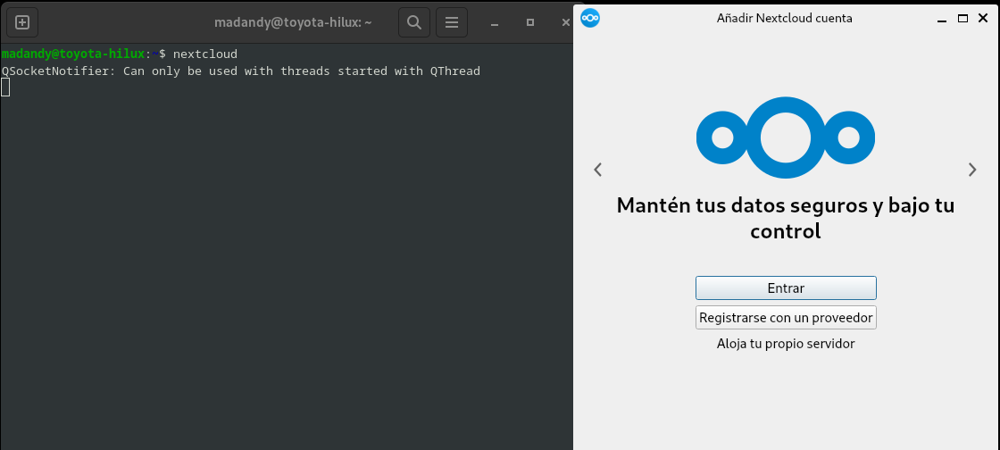
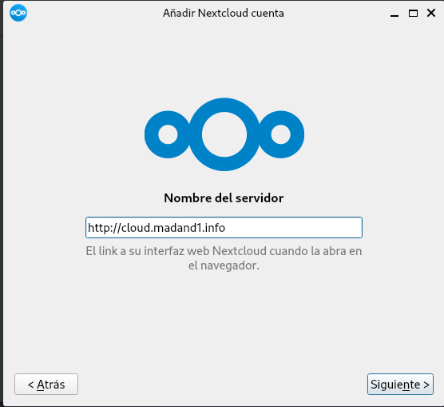
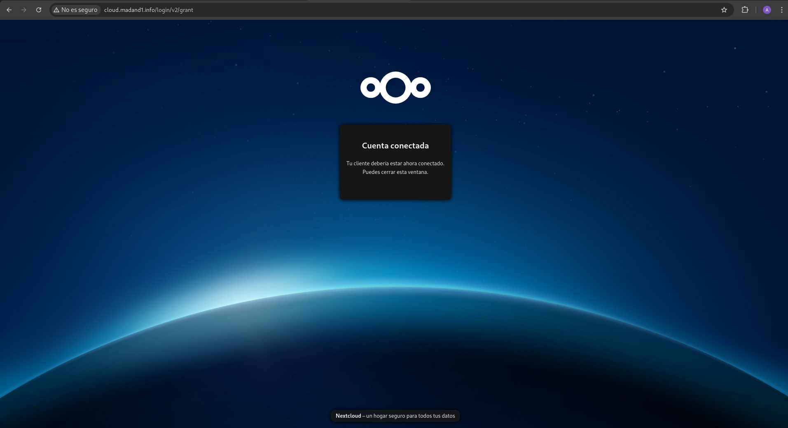
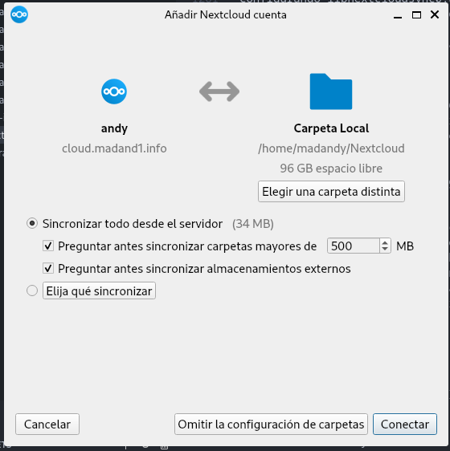
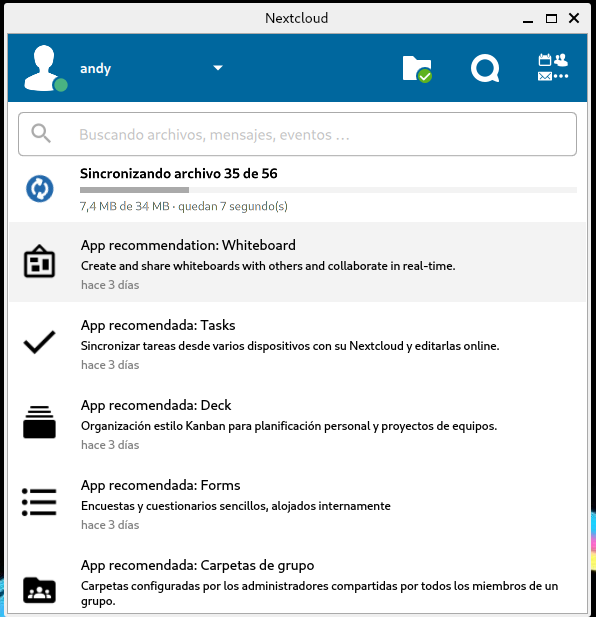
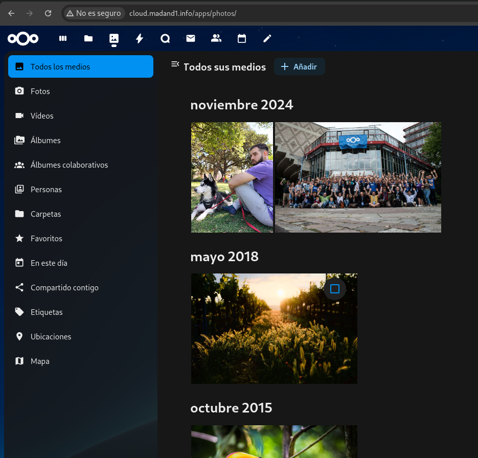
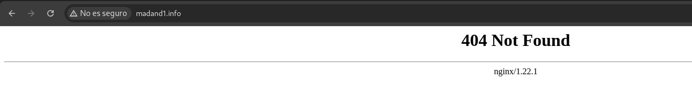

# Práctica (1 / 3): Instalación/migración de aplicaciones web PHP

## Escenario

Crearemos un escenario con vagrant, kvm o openstack con las siguientes características:

Dos máquinas virtuales que se llamen servidor_web_tunombre y servidor_bd_tunombre.

Las máquinas estarán conectadas a una red que les proporcione salida a internet.

Las dos máquinas están conectadas entre si por una red muy aislada.

### Archivo Vagrant (Vagrantfile)
Con lo que se nos quedará un esqueleto de la siguiente manera:

```
vagrant.configure("2") do |config|

  # Servidor Web
  config.vm.define :web do |web| # Cambiado a "web"
    web.vm.box = "debian/bookworm64" # Imagen de Debian 12 (bookworm)
    web.vm.hostname = "web" # Nombre del host simplificado
    web.vm.synced_folder ".", "/vagrant", disabled: true
    
    # Red pública (con salida a Internet)
    web.vm.network :public_network,
      :dev => "br0", # Interfaz de puente
      :mode => "bridge",
      :type => "bridge" 

    # Red privada (muy aislada)
    web.vm.network :private_network,
      :libvirt__network_name => "red_intra", # Nombre de la red privada
      :libvirt__dhcp_enabled => false, # DHCP deshabilitado
      :ip => "10.0.0.2", # IP del servidor web
      :libvirt__forward_mode => "veryisolated" 
  end

  # Servidor de Base de Datos
  config.vm.define :bd do |db| # Cambiado a "bd"
    db.vm.box = "debian/bookworm64" # Imagen de Debian 12 (bookworm)
    db.vm.hostname = "bd" # Nombre del host simplificado
    db.vm.synced_folder ".", "/vagrant", disabled: true

    # Red pública (con salida a Internet)
    db.vm.network :public_network,
      :dev => "br0", # Interfaz de puente
      :mode => "bridge",
      :type => "bridge" 

    # Red privada (muy aislada)
    db.vm.network :private_network,
      :libvirt__network_name => "red_intra", # Nombre de la red privada
      :libvirt__dhcp_enabled => false, # DHCP deshabilitado
      :ip => "10.0.0.3", # IP del servidor de base de datos
      :libvirt__forward_mode => "veryisolated" 
  end
end

```

Una vez que lo tenemos ya todo definido, obviamente se podria simplificar y se quedaria tal que asi:

```
Vagrant.configure("2") do |config|

  # Definir máquinas
  %w[web bd].each do |tipo|
    config.vm.define tipo do |maquina|
      maquina.vm.box = "debian/bookworm64" # Imagen de Debian 12
      maquina.vm.hostname = tipo # Nombre de la máquina

      # Carpeta sincronizada (deshabilitada)
      maquina.vm.synced_folder ".", "/vagrant", disabled: true

      # Red pública (con salida a Internet)
      maquina.vm.network :public_network, dev: "br0", mode: "bridge"

      # Red privada (muy aislada)
      maquina.vm.network :private_network,
        ip: tipo == "web" ? "10.0.0.2" : "10.0.0.3", # IP según el tipo
        libvirt__network_name: "red_intra", # Nombre de la red privada
        libvirt__dhcp_enabled: false, # DHCP deshabilitado
        libvirt__forward_mode: "veryisolated" # Modo de reenvío
    end
  end
end

```

una vez contruido ya nuestro escenario para esta parte lo que tendremos que realizar es la conexión por ssh, desde el directorio donde tenemos el Vagrantfile, en mi caso es el siguiente directorio:

```
madandy@toyota-hilux:~/Documentos/SegundoASIR/github/iweb/Migración$
```
### Entrar por SSH

Una vez estando en el directorio lo que haremos será entrar por ssh a través de los comando siguientes que pongo a continuación:

```
vagrant ssh web
vagrant ssh bd 
```
### Comprobación de direccionamiento

A continuación muestro el como se ve desde dentro con su direccionamiento:

*Vagrant web*

```
vagrant@web-andy:~$ ip a
1: lo: <LOOPBACK,UP,LOWER_UP> mtu 65536 qdisc noqueue state UNKNOWN group default qlen 1000
    link/loopback 00:00:00:00:00:00 brd 00:00:00:00:00:00
    inet 127.0.0.1/8 scope host lo
       valid_lft forever preferred_lft forever
    inet6 ::1/128 scope host noprefixroute 
       valid_lft forever preferred_lft forever
2: eth0: <BROADCAST,MULTICAST,UP,LOWER_UP> mtu 1500 qdisc fq_codel state UP group default qlen 1000
    link/ether 52:54:00:5f:8e:c7 brd ff:ff:ff:ff:ff:ff
    altname enp0s5
    altname ens5
    inet 192.168.121.155/24 brd 192.168.121.255 scope global dynamic eth0
       valid_lft 3534sec preferred_lft 3534sec
    inet6 fe80::5054:ff:fe5f:8ec7/64 scope link 
       valid_lft forever preferred_lft forever
3: eth1: <BROADCAST,MULTICAST,UP,LOWER_UP> mtu 1500 qdisc fq_codel state UP group default qlen 1000
    link/ether 52:54:00:ea:53:43 brd ff:ff:ff:ff:ff:ff
    altname enp0s6
    altname ens6
    inet 192.168.1.143/24 brd 192.168.1.255 scope global dynamic eth1
       valid_lft 83452sec preferred_lft 83452sec
    inet6 2a0c:5a85:a40c:5d00:5054:ff:feea:5343/64 scope global dynamic mngtmpaddr 
       valid_lft forever preferred_lft forever
    inet6 fe80::5054:ff:feea:5343/64 scope link 
       valid_lft forever preferred_lft forever
4: eth2: <BROADCAST,MULTICAST,UP,LOWER_UP> mtu 1500 qdisc fq_codel state UP group default qlen 1000
    link/ether 52:54:00:8b:6b:d8 brd ff:ff:ff:ff:ff:ff
    altname enp0s7
    altname ens7
    inet 10.0.0.2/24 brd 10.0.0.255 scope global eth2
       valid_lft forever preferred_lft forever
    inet6 fe80::5054:ff:fe8b:6bd8/64 scope link 
       valid_lft forever preferred_lft forever


```

*Vagrant bd*

```vagrant@bd-andy:~$ ip a
1: lo: <LOOPBACK,UP,LOWER_UP> mtu 65536 qdisc noqueue state UNKNOWN group default qlen 1000
    link/loopback 00:00:00:00:00:00 brd 00:00:00:00:00:00
    inet 127.0.0.1/8 scope host lo
       valid_lft forever preferred_lft forever
    inet6 ::1/128 scope host noprefixroute 
       valid_lft forever preferred_lft forever
2: eth0: <BROADCAST,MULTICAST,UP,LOWER_UP> mtu 1500 qdisc fq_codel state UP group default qlen 1000
    link/ether 52:54:00:48:7a:3f brd ff:ff:ff:ff:ff:ff
    altname enp0s5
    altname ens5
    inet 192.168.121.194/24 brd 192.168.121.255 scope global dynamic eth0
       valid_lft 3579sec preferred_lft 3579sec
    inet6 fe80::5054:ff:fe48:7a3f/64 scope link 
       valid_lft forever preferred_lft forever
3: eth1: <BROADCAST,MULTICAST,UP,LOWER_UP> mtu 1500 qdisc fq_codel state UP group default qlen 1000
    link/ether 52:54:00:f8:ff:6b brd ff:ff:ff:ff:ff:ff
    altname enp0s6
    altname ens6
    inet 192.168.1.142/24 brd 192.168.1.255 scope global dynamic eth1
       valid_lft 83400sec preferred_lft 83400sec
    inet6 2a0c:5a85:a40c:5d00:5054:ff:fef8:ff6b/64 scope global dynamic mngtmpaddr 
       valid_lft forever preferred_lft forever
    inet6 fe80::5054:ff:fef8:ff6b/64 scope link 
       valid_lft forever preferred_lft forever
4: eth2: <BROADCAST,MULTICAST,UP,LOWER_UP> mtu 1500 qdisc fq_codel state UP group default qlen 1000
    link/ether 52:54:00:39:90:35 brd ff:ff:ff:ff:ff:ff
    altname enp0s7
    altname ens7
    inet 10.0.0.3/24 brd 10.0.0.255 scope global eth2
       valid_lft forever preferred_lft forever
    inet6 fe80::5054:ff:fe39:9035/64 scope link 
       valid_lft forever preferred_lft forever


```

### Comprobación de conectividad tanto al exterior como entre ellos

- Servidor WEB

```
vagrant@web:~$ ping 8.8.8.8
PING 8.8.8.8 (8.8.8.8) 56(84) bytes of data.
64 bytes from 8.8.8.8: icmp_seq=1 ttl=110 time=16.4 ms
64 bytes from 8.8.8.8: icmp_seq=2 ttl=110 time=17.5 ms
^C
--- 8.8.8.8 ping statistics ---
2 packets transmitted, 2 received, 0% packet loss, time 1002ms
rtt min/avg/max/mdev = 16.448/16.995/17.543/0.547 ms
vagrant@web:~$ ping -c 4 10.0.0.3
PING 10.0.0.3 (10.0.0.3) 56(84) bytes of data.
64 bytes from 10.0.0.3: icmp_seq=1 ttl=64 time=1.02 ms
64 bytes from 10.0.0.3: icmp_seq=2 ttl=64 time=1.35 ms
64 bytes from 10.0.0.3: icmp_seq=3 ttl=64 time=1.39 ms
^C
--- 10.0.0.3 ping statistics ---
3 packets transmitted, 3 received, 0% packet loss, time 2003ms
rtt min/avg/max/mdev = 1.016/1.252/1.394/0.168 ms

```

- Sevidor base de datos

```
vagrant@bd:~$ ping 10.0.0.2
PING 10.0.0.2 (10.0.0.2) 56(84) bytes of data.
64 bytes from 10.0.0.2: icmp_seq=1 ttl=64 time=0.640 ms
^C
--- 10.0.0.2 ping statistics ---
1 packets transmitted, 1 received, 0% packet loss, time 0ms
rtt min/avg/max/mdev = 0.640/0.640/0.640/0.000 ms
vagrant@bd:~$ ping -c 4 8.8.8.8
PING 8.8.8.8 (8.8.8.8) 56(84) bytes of data.
64 bytes from 8.8.8.8: icmp_seq=1 ttl=110 time=16.9 ms
64 bytes from 8.8.8.8: icmp_seq=2 ttl=110 time=17.0 ms
^C
--- 8.8.8.8 ping statistics ---
2 packets transmitted, 2 received, 0% packet loss, time 1002ms
rtt min/avg/max/mdev = 16.883/16.938/16.993/0.055 ms
vagrant@bd:~$ 

```

## Instalación de un CMS PHP en mi servidor localPermalink
Para esta ocasión he elegico como CMS *Drupal*, en el cual para su correcta instalación hice lo siguiente:

* En el servidor web haremos lo siguiente:

1. Requisitos previos 

Antes de comenzar la instalación de Nextcloud, tendremos que asegurarnos que nuetsro servidor tenga Apache, PHP y las extensiones necesarias instaladas. 
Aquí están los comandos para instalar las extensiones necesarias:

```
sudo apt update
sudo apt install apache2 php8.3 libapache2-mod-php8.3 php8.3-mysql php8.3-gd php8.3-xml php8.3-mbstring php8.3-curl
```
2. Descagaremos drupal:

```
cd /tmp
wget https://www.drupal.org/download-latest/tar.gz -O drupal.tar.gz
tar -xzf drupal.tar.gz
sudo mv drupal-* /var/www/html/drupal
```
3. Configuraremos los permisos:


```
sudo chown -R www-data:www-data /var/www/html/drupal
sudo chmod -R 755 /var/www/html/drupal
```
4. Cinfiguraremos Apache VirtualHost:

Creación y edición del archivo:
```
sudo nano /etc/apache2/sites-available/andresmorales.conf
```
Añadir la siguiente configuración:

```
vagrant@web-andy:~$ cat /etc/apache2/sites-available/andresmorales.conf 
<VirtualHost *:80>
    ServerAdmin admin@madand1-amg.org
    ServerName www.madand1-amg.org
    DocumentRoot /var/www/drupal

    <Directory /var/www/drupal>
        Options Indexes FollowSymLinks MultiViews
        AllowOverride All
        Require all granted
    </Directory>

    ErrorLog ${APACHE_LOG_DIR}/madand1-amg_error.log
    CustomLog ${APACHE_LOG_DIR}/madand1-amg_access.log combined
</VirtualHost>

```

5. habiliartamos el sitio y modulos de APache:

```
sudo a2ensite andresmorales.conf
sudo a2enmod rewrite
sudo systemctl restart apache2
```


6. Y por ultimo tenemos que hacer la prueba de conexión:

Para ello lo que haremos será meter en este caso en mi fichero */etc/hosts* de mi anfitrión, la ip con el nomnbre para que esta se redirija a la _vm_:

```
madandy@toyota-hilux:~$ cat /etc/hosts
......
.....
....
...
#Practia 1 de seguridad
172.22.201.196    www.sad.com

#Practica iweb 2

192.168.1.143   www.madand1-amg.org 
192.168.1.143   madand1-amg.org
192.168.1.143   cloud.madand1-amg.org
....
...
..
.
```


## Servidor Bases de datos
* En el servidor de mariadb

1. Instalaremos mariadb:


```
sudo apt install mysql-server
sudo mysql_secure_installation
```

2. Crearemos la base de datos.

```
vagrant@bd-andy:~$ sudo mysql
Welcome to the MariaDB monitor.  Commands end with ; or \g.
Your MariaDB connection id is 31
Server version: 10.11.6-MariaDB-0+deb12u1 Debian 12

Copyright (c) 2000, 2018, Oracle, MariaDB Corporation Ab and others.

Type 'help;' or '\h' for help. Type '\c' to clear the current input statement.

MariaDB [(none)]> CREATE DATABASE drupal_db;
Query OK, 1 row affected (0.000 sec)

MariaDB [(none)]> CREATE USER 'andy'@'%' IDENTIFIED BY 'andy';
Query OK, 0 rows affected (0.007 sec)

MariaDB [(none)]> GRANT ALL PRIVILEGES ON drupal_db.* TO 'andy'@'%';
Query OK, 0 rows affected (0.006 sec)

MariaDB [(none)]> FLUSH PRIVILEGES;
Query OK, 0 rows affected (0.001 sec)

MariaDB [(none)]> EXIT;
Bye
```
## Comprobación de entrada a la web drupal:

```http://madand1-amg.org```


## Instalación de nextcloud

Lo que he hecho ha sido todo estos pasos en el servidor web.

Lo primero que he hecho ha sido, la intstalación de Apache y PHP con el siguiente comando:

```
sudo apt install apache2 php8.3 libapache2-mod-php8.3 php8.3-mysql php8.3-gd php8.3-xml php8.3-mbstring php8.3-curl php8.3-zip php8.3-intl
```
Despues lo que he hecho ha sido descargarme lo que será Nextcloud, me he descaghar la versión especifica (30.0.2) desde aqui:

```
cd /tmp
wget https://download.nextcloud.com/server/releases/nextcloud-30.0.2.tar.bz2
```
Luego lo he descomprimido:

```
tar -xjf nextcloud-30.0.2.tar.bz2
```

Lo he movido al directoiro Web

```
sudo mv nextcloud /var/www/
```
He configurado los permisos para que Apache pudiera acceder a los archivos de Nextcloud:

```
sudo chown -R www-data:www-data /var/www/nextcloud
sudo chmod -R 755 /var/www/nextcloud
```
He comfigurado el virtual host en la siguiente direccion:

```
sudo nano /etc/apache2/sites-available/cloud.andresmorales.org.conf

```

Y he metido la siguiente configuracion:

```
vagrant@web-andy:~$ cat /etc/apache2/sites-available/cloud.andresmorales.org.conf 
<VirtualHost *:80>
    ServerAdmin admin@madand1-amg.org
    ServerName cloud.madand1-amg.org
    DocumentRoot /var/www/nextcloud

    <Directory /var/www/nextcloud>
        Options Indexes FollowSymLinks MultiViews
        AllowOverride All
        Require all granted
    </Directory>

    ErrorLog ${APACHE_LOG_DIR}/nextcloud_error.log
    CustomLog ${APACHE_LOG_DIR}/nextcloud_access.log combined
</VirtualHost>
vagrant@web-andy:~$ 

```
He habilitado el sitio y reiniciado Apache:

```
sudo a2ensite cloud.nombrealumno.org.conf
sudo systemctl restart apache2
```

Y una vez hecho esto he puesto en mi host la siguiente, en el fichero */etc/hosts* de mi pc anfitrion:

```
madandy@toyota-hilux:~/Documentos/SegundoASIR/github/iweb/Migración$ cat /etc/hosts
127.0.0.1	localhost
127.0.1.1	toyota-hilux
172.22.8.205	biblioteca.andres.org
172.22.123.100    openstack.gonzalonazareno.org

#Practia 1 de seguridad
172.22.201.196    www.sad.com

#Practica iweb 2

192.168.1.143   www.madand1-amg.org 
192.168.1.143   madand1-amg.org
192.168.1.143   cloud.madand1-amg.org

```

Y por ultimo hacemos la prueba y vemos como entramos por la URL aamigable:



He cogido la misma base de datos en ambos caso, y el user y tal es el siguiente:

```
usuario andy contraseña andy
```

# Práctica (2 / 3): Instalación/migración de aplicaciones web PHP


## Migración de Nextcloud


1. Preparación de la *VPS*

Lo primero que vamos a hacer es esto:

```
   22  sudo apt update && sudo apt upgrade -y
   23  sudo apt install nginx -y
   24  sudo apt install mysql-server -y
   25  sudo apt install mariadb-server -y
   26  sudo apt install php-fpm php-mysql php-curl php-gd php-mbstring php-xml php-zip -y
   27  sudo apt install php8.3 php8.3-cli php8.3-common php8.3-curl php8.3-mbstring php8.3-mysql php8.3-xml php8.3-zip php8.3-gd -y
   28  sudo apt update
   29  sudo apt install software-properties-common -y
   30  sudo add-apt-repository ppa:ondrej/php
   31  sudo apt update
   32  sudo apt install php8.3 php8.3-cli php8.3-common php8.3-curl php8.3-mbstring php8.3-mysql php8.3-xml php8.3-zip php8.3-gd -y
   33  php -v
   34  sudo add-apt-repository ppa:ondrej/php -y
   35  php -v
   36  sudo add-apt-repository ppa:ondrej/php
   37  sudo apt install --reinstall software-properties-common -y
   38  sudo add-apt-repository ppa:ondrej/php
   39  echo "deb http://ppa.launchpad.net/ondrej/php/ubuntu $(lsb_release -cs) main" | sudo tee /etc/apt/sources.list.d/ondrej-php.list
   40  sudo apt-key adv --keyserver keyserver.ubuntu.com --recv-keys E5267A6C
   41  sudo apt update
   42  sudo apt update
   43  sudo apt install php8.3 php8.3-cli php8.3-common php8.3-curl php8.3-mbstring php8.3-mysql php8.3-xml php8.3-zip php8.3-gd -y
   44  sudo apt install ppa-purge -y
   45  sudo ppa-purge ppa:ondrej/php
   46  php --v
   47  php -v
   48  apt list | grep php8.3
   49  sudo apt update
   50  sudo apt install -y build-essential libxml2-dev libssl-dev libcurl4-openssl-dev libjpeg-dev libpng-dev libwebp-dev libfreetype6-dev libonig-dev libzip-dev
   51  wget https://www.php.net/distributions/php-8.3.13.tar.gz
   52  tar -xzvf php-8.3.13.tar.gz
   53  cd php-8.3.13
   54  ./configure --prefix=/usr/local/php8.3 --with-zlib --with-curl --with-openssl --enable-mbstring --with-mysqli --with-pdo-mysql --enable-soap --enable-zip --with-gd --with-jpeg --with-webp --with-freetype
   55  make
   56  php -v
   57  ./configure --prefix=/usr/local/php8.3 --with-zlib --with-curl --with-openssl --enable-mbstring --with-mysqli --with-pdo-mysql --enable-soap --enable-zip --with-gd --with-jpeg --with-webp --with-freetype
   58  make
   59  sudo apt install -y pkg-config libxml2-dev libssl-dev libcurl4-openssl-dev libjpeg-dev libpng-dev libwebp-dev libfreetype6-dev
   60  ./configure --prefix=/usr/local/php8.3 --with-zlib --with-curl --with-openssl --enable-mbstring --with-mysqli --with-pdo-mysql --enable-soap --with-gd --with-jpeg --with-webp --with-freetype
   61  make
   62  sudo apt install -y libsqlite3-dev
   63  ./configure --prefix=/usr/local/php8.3 --with-zlib --with-curl --with-openssl --enable-mbstring --with-mysqli --with-pdo-mysql --enable-soap --with-gd --with-jpeg --with-webp --with-freetype
   64  make
   65  sudo apt-get install libgd-dev
   66  ./configure --enable-gd --with-jpeg --with-webp --with-freetype
   67  make
   68  free -h
   69  sudo fallocate -l 2G /swapfile
   70  sudo chmod 600 /swapfile
   71  sudo mkswap /swapfile
   72  sudo swapon /swapfile
   73  free -h
   74  sudo sh -c 'echo "/swapfile none swap sw 0 0" >> /etc/fstab'
   75  make -j1
   76  sudo make test
   77  sudo apt install autoconf
   78  sudo apt install build-essential libxml2-dev libssl-dev libcurl4-openssl-dev
   79  sudo make test
   80  sudo make install
   81  php -v
   82  update-alternatives --display php
   83  sudo update-alternatives --install /usr/bin/php php /usr/local/bin/php 1
   84  sudo update-alternatives --install /usr/bin/phpize phpize /usr/local/bin/phpize 1
   85  sudo update-alternatives --install /usr/bin/php-config php-config /usr/local/bin/php-config 1
   86  sudo update-alternatives --config php
   87  php -v


```

Aqui lo tengo explicado:

```

Hasta ahora, has realizado varios pasos importantes para instalar y configurar PHP 8.3.13 en tu sistema, incluyendo la instalación de dependencias necesarias, la compilación de PHP desde el código fuente, y la configuración de la versión predeterminada. Aquí está el resumen de lo que has hecho:

Actualización del sistema y la instalación de paquetes:

Actualizaste los repositorios y los paquetes instalados en tu sistema con sudo apt update && sudo apt upgrade -y.
Instalaste servicios y dependencias como nginx, mysql-server, mariadb-server, y varias extensiones de PHP (php-fpm, php-mysql, php-curl, php-gd, etc.).
Instalación de PHP desde el repositorio PPA:

Añadiste el repositorio de PHP de Ondrej y lo configuraste para instalar PHP 8.3 y sus extensiones necesarias.
A pesar de algunos intentos fallidos con ppa-purge, lograste instalar PHP 8.3 mediante el repositorio de Ondrej.
Compilación de PHP desde código fuente:

Descargaste el código fuente de PHP 8.3.13 con wget y descomprimiste el archivo tar.gz.
Configuraste y compilaste PHP utilizando el comando ./configure con diversas opciones para habilitar las extensiones necesarias.
Al enfrentar problemas durante la compilación, instalaste las dependencias faltantes, como pkg-config, libxml2-dev, libssl-dev, libcurl4-openssl-dev, libjpeg-dev, y otras, y repetiste el proceso de compilación con make.
Durante la compilación, aumentaste la memoria virtual (swap) para evitar errores de memoria insuficiente.
Realizaste una prueba con make test para verificar que la instalación fuera correcta, aunque algunos tests fallaron.
Instalación y configuración final:

Usaste sudo make install para instalar PHP y sus binarios en tu sistema.
Configuraste PHP 8.3 como la versión predeterminada con update-alternatives, para que php apunte a /usr/local/bin/php.
Verificación:

Finalmente, verificaste que la versión de PHP instalada es la correcta con php -v, mostrando que ahora tienes PHP 8.3.13.
En resumen, has instalado PHP 8.3.13 desde el código fuente y lo configuraste correctamente como la versión predeterminada en tu sistema. Si necesitas configurar otros servicios o realizar ajustes adicionales, estaré aquí para ayudarte.
```

2. Exportar la base de datos

Ahora exportaremos la base de datos de nuestro servidor local. Esto lo haremos tanto para drupal que es el CMS que hemos usado como para Nextcloud, gracias al siguiente ocmando:

```

mysqldump -u andy -p drupal_db > migracion.sql

```
Aqui la comprobación de ambos comandos:

```
vagrant@bd-andy:~$ mysqldump -u andy -p drupal_db > migracion.sql
Enter password: 
vagrant@bd-andy:~$ ls
migracion.sql

```
Ahora procederemos a exportarlo con el comando scp a for-raptor.madand1.info

```
vagrant@bd-andy:~$ scp migracion.sql root@ford-raptor.madand1.info:/home/root
The authenticity of host 'ford-raptor.madand1.info (217.160.226.33)' can't be established.
ED25519 key fingerprint is SHA256:Ek2rQnoGBO8Fpt2/kR3Q9YT9Dp58fKibLSgG+FNze70.
This key is not known by any other names.
Are you sure you want to continue connecting (yes/no/[fingerprint])? yes
Warning: Permanently added 'ford-raptor.madand1.info' (ED25519) to the list of known hosts.
root@ford-raptor.madand1.info's password: 
Permission denied, please try again.
root@ford-raptor.madand1.info's password: 
migracion.sql                                 100%   12MB   9.1MB/s   00:01    
vagrant@bd-andy:~$ 

```
Y si vemos en nuestro vps:

```
root@ford-raptor:~# ls
migracion.sql  php-8.3.13
root@ford-raptor:~# 

```

Ahora vamos a proceder a entrar en el servidor web antiguo, y comprimir la carpeta Nextcloud:

```
vagrant@web-andy:$ cd /var/www/

vagrant@web-andy:/var/www$ sudo apt install zip -y

vagrant@web-andy:/var/www$ sudo zip -r nextcloud.zip nextcloud

vagrant@web-andy:/var/www$ ls
drupal  drupal-11.0.6  drupal.tar.gz  html  nextcloud  nextcloud.zip

```

Y lo migramos a la *VPS*:

```
vagrant@web-andy:/var/www$ scp nextcloud.zip root@ford-raptor.madand1.info:/root
root@ford-raptor.madand1.info's password: 
nextcloud.zip                                100%  363MB   8.0MB/s   00:45                               100%  363MB   8.2MB/s   00:44  
```
Comprobamos en nuestra VPS:

```
root@ford-raptor:~# ls
migracion.sql  nextcloud.zip  php-8.3.13
root@ford-raptor:~# 

```
Ahroa en nuestra VPS descomprimimos la carpeta:

```
root@ford-raptor:~# unzip nextcloud.zip -d /var/www/nextcloud

```

ya tenemos los módulos necesarios intalados con anterioridad, con lo que procederemos a darles permiso a la carpeta:

```
root@ford-raptor:~# sudo chown -R www-data:www-data /var/www/nextcloud
root@ford-raptor:~# sudo chmod -R 755 /var/www/nextcloud

```
Y la verificamos:

```
root@ford-raptor:/var/www/nextcloud/nextcloud# ls -l
total 1304
drwxr-xr-x 42 www-data www-data    4096 Nov  7 08:40 3rdparty
-rwxr-xr-x  1 www-data www-data   26314 Nov  7 08:37 AUTHORS
-rwxr-xr-x  1 www-data www-data   34520 Nov  7 08:37 COPYING
drwxr-xr-x  2 www-data www-data    4096 Nov  7 08:37 LICENSES
drwxr-xr-x 60 www-data www-data    4096 Nov  7 17:41 apps
-rwxr-xr-x  1 www-data www-data    2079 Nov  7 08:37 composer.json
-rwxr-xr-x  1 www-data www-data    3400 Nov  7 08:37 composer.lock
drwxr-xr-x  2 www-data www-data    4096 Nov  7 17:40 config
-rwxr-xr-x  1 www-data www-data    3810 Nov  7 08:37 console.php
drwxr-xr-x 24 www-data www-data    4096 Nov  7 08:40 core
-rwxr-xr-x  1 www-data www-data    7550 Nov  7 08:37 cron.php
drwxr-xr-x  4 www-data www-data    4096 Nov  7 17:40 data
drwxr-xr-x  2 www-data www-data   20480 Nov  7 08:37 dist
-rwxr-xr-x  1 www-data www-data     331 Nov  7 08:37 index.html
-rwxr-xr-x  1 www-data www-data    3485 Nov  7 08:37 index.php
drwxr-xr-x  6 www-data www-data    4096 Nov  7 08:37 lib
-rwxr-xr-x  1 www-data www-data     308 Nov  7 08:37 occ
drwxr-xr-x  2 www-data www-data    4096 Nov  7 08:37 ocs
drwxr-xr-x  2 www-data www-data    4096 Nov  7 08:37 ocs-provider
-rwxr-xr-x  1 www-data www-data 1131946 Nov  7 08:37 package-lock.json
-rwxr-xr-x  1 www-data www-data    7227 Nov  7 08:37 package.json
-rwxr-xr-x  1 www-data www-data    2821 Nov  7 08:37 public.php
-rwxr-xr-x  1 www-data www-data    4435 Nov  7 08:37 remote.php
drwxr-xr-x  4 www-data www-data    4096 Nov  7 08:37 resources
-rwxr-xr-x  1 www-data www-data      26 Nov  7 08:37 robots.txt
-rwxr-xr-x  1 www-data www-data    1327 Nov  7 08:37 status.php
drwxr-xr-x  3 www-data www-data    4096 Nov  7 08:37 themes
drwxr-xr-x  2 www-data www-data    4096 Nov  7 08:38 updater
-rwxr-xr-x  1 www-data www-data     383 Nov  7 08:40 version.php

```

Configuraremos la base de datos en la VPS:

```
root@ford-raptor:~# mysql -u root -p
Enter password: 
Welcome to the MariaDB monitor.  Commands end with ; or \g.
Your MariaDB connection id is 31
Server version: 10.11.6-MariaDB-0+deb12u1 Debian 12

Copyright (c) 2000, 2018, Oracle, MariaDB Corporation Ab and others.

Type 'help;' or '\h' for help. Type '\c' to clear the current input statement.

MariaDB [(none)]> CREATE DATABASE drupal_db;
Query OK, 1 row affected (0.004 sec)

MariaDB [(none)]> CREATE USER 'andy'@'localhost' IDENTIFIED BY 'andy';
Query OK, 0 rows affected (0.021 sec)

MariaDB [(none)]> GRANT ALL PRIVILEGES ON drupal_db.* TO 'andy'@'localhost';
Query OK, 0 rows affected (0.003 sec)

MariaDB [(none)]> FLUSH PRIVILEGES;
Query OK, 0 rows affected (0.005 sec)

MariaDB [(none)]> EXIT;
Bye

```

Importamos la base de datos:

```
root@ford-raptor:~# mysql -u andy -p drupal_db < migracion.sql 
Enter password: 

```

Verificamos:

```
root@ford-raptor:~# mysql -u andy -p drupal_db
Enter password: 
Reading table information for completion of table and column names
You can turn off this feature to get a quicker startup with -A

Welcome to the MariaDB monitor.  Commands end with ; or \g.
Your MariaDB connection id is 37
Server version: 10.11.6-MariaDB-0+deb12u1 Debian 12

Copyright (c) 2000, 2018, Oracle, MariaDB Corporation Ab and others.

Type 'help;' or '\h' for help. Type '\c' to clear the current input statement.

MariaDB [drupal_db]> show tables;
+----------------------------------+
| Tables_in_drupal_db              |
+----------------------------------+
| batch                            |
| block_content                    |
| block_content__body              |
| block_content_field_data         |
| block_content_field_revision     |
| block_content_revision           |
| block_content_revision__body     |
| cache_access_policy              |
| cache_bootstrap                  |
| cache_config                     |
| cache_container                  |
| cache_data                       |
| cache_default                    |
| cache_discovery                  |
| cache_dynamic_page_cache         |
| cache_entity                     |
| cache_menu                       |
| cache_page                       |
| cache_render                     |
| cachetags                        |
| comment                          |
| comment__comment_body            |
| comment_entity_statistics        |
| comment_field_data               |
| config                           |
| file_managed                     |
| file_usage                       |
| help_search_items                |
| history                          |
| key_value                        |
| key_value_expire                 |
| locale_file                      |
| locales_location                 |
| locales_source                   |
| locales_target                   |
| menu_link_content                |
| menu_link_content_data           |
| menu_link_content_field_revision |
| menu_link_content_revision       |
| menu_tree                        |
| node                             |
| node__body                       |
| node__comment                    |
| node__field_image                |
| node__field_tags                 |
| node_access                      |
| node_field_data                  |
| node_field_revision              |
| node_revision                    |
| node_revision__body              |
| node_revision__comment           |
| node_revision__field_image       |
| node_revision__field_tags        |
| oc_accounts                      |
| oc_accounts_data                 |
| oc_activity                      |
| oc_activity_mq                   |
| oc_addressbookchanges            |
| oc_addressbooks                  |
| oc_appconfig                     |
| oc_appconfig_ex                  |
| oc_authorized_groups             |
| oc_authtoken                     |
| oc_bruteforce_attempts           |
| oc_calendar_appt_bookings        |
| oc_calendar_appt_configs         |
| oc_calendar_invitations          |
| oc_calendar_reminders            |
| oc_calendar_resources            |
| oc_calendar_resources_md         |
| oc_calendar_rooms                |
| oc_calendar_rooms_md             |
| oc_calendarchanges               |
| oc_calendarobjects               |
| oc_calendarobjects_props         |
| oc_calendars                     |
| oc_calendarsubscriptions         |
| oc_cards                         |
| oc_cards_properties              |
| oc_circles_circle                |
| oc_circles_event                 |
| oc_circles_member                |
| oc_circles_membership            |
| oc_circles_mount                 |
| oc_circles_mountpoint            |
| oc_circles_remote                |
| oc_circles_share_lock            |
| oc_circles_token                 |
| oc_collres_accesscache           |
| oc_collres_collections           |
| oc_collres_resources             |
| oc_comments                      |
| oc_comments_read_markers         |
| oc_dav_absence                   |
| oc_dav_cal_proxy                 |
| oc_dav_shares                    |
| oc_direct_edit                   |
| oc_directlink                    |
| oc_ex_apps                       |
| oc_ex_apps_daemons               |
| oc_ex_apps_routes                |
| oc_ex_event_handlers             |
| oc_ex_occ_commands               |
| oc_ex_settings_forms             |
| oc_ex_speech_to_text             |
| oc_ex_speech_to_text_q           |
| oc_ex_task_processing            |
| oc_ex_text_processing            |
| oc_ex_text_processing_q          |
| oc_ex_translation                |
| oc_ex_translation_q              |
| oc_ex_ui_files_actions           |
| oc_ex_ui_scripts                 |
| oc_ex_ui_states                  |
| oc_ex_ui_styles                  |
| oc_ex_ui_top_menu                |
| oc_federated_reshares            |
| oc_file_locks                    |
| oc_filecache                     |
| oc_filecache_extended            |
| oc_files_metadata                |
| oc_files_metadata_index          |
| oc_files_reminders               |
| oc_files_trash                   |
| oc_files_versions                |
| oc_flow_checks                   |
| oc_flow_operations               |
| oc_flow_operations_scope         |
| oc_group_admin                   |
| oc_group_user                    |
| oc_groups                        |
| oc_jobs                          |
| oc_known_users                   |
| oc_login_flow_v2                 |
| oc_mail_accounts                 |
| oc_mail_aliases                  |
| oc_mail_attachments              |
| oc_mail_classifiers              |
| oc_mail_coll_addresses           |
| oc_mail_internal_address         |
| oc_mail_local_messages           |
| oc_mail_mailboxes                |
| oc_mail_message_tags             |
| oc_mail_messages                 |
| oc_mail_messages_retention       |
| oc_mail_messages_snoozed         |
| oc_mail_provisionings            |
| oc_mail_recipients               |
| oc_mail_smime_certificates       |
| oc_mail_tags                     |
| oc_mail_trusted_senders          |
| oc_migrations                    |
| oc_mimetypes                     |
| oc_mounts                        |
| oc_notes_meta                    |
| oc_notifications                 |
| oc_notifications_pushhash        |
| oc_notifications_settings        |
| oc_oauth2_access_tokens          |
| oc_oauth2_clients                |
| oc_open_local_editor             |
| oc_photos_albums                 |
| oc_photos_albums_collabs         |
| oc_photos_albums_files           |
| oc_preferences                   |
| oc_preferences_ex                |
| oc_privacy_admins                |
| oc_profile_config                |
| oc_properties                    |
| oc_ratelimit_entries             |
| oc_reactions                     |
| oc_recent_contact                |
| oc_richdocuments_assets          |
| oc_richdocuments_direct          |
| oc_richdocuments_template        |
| oc_richdocuments_wopi            |
| oc_schedulingobjects             |
| oc_share                         |
| oc_share_external                |
| oc_shares_limits                 |
| oc_storages                      |
| oc_storages_credentials          |
| oc_systemtag                     |
| oc_systemtag_group               |
| oc_systemtag_object_mapping      |
| oc_talk_attachments              |
| oc_talk_attendees                |
| oc_talk_bans                     |
| oc_talk_bots_conversation        |
| oc_talk_bots_server              |
| oc_talk_bridges                  |
| oc_talk_commands                 |
| oc_talk_consent                  |
| oc_talk_internalsignaling        |
| oc_talk_invitations              |
| oc_talk_poll_votes               |
| oc_talk_polls                    |
| oc_talk_proxy_messages           |
| oc_talk_reminders                |
| oc_talk_retry_ocm                |
| oc_talk_rooms                    |
| oc_talk_sessions                 |
| oc_taskprocessing_tasks          |
| oc_text2image_tasks              |
| oc_text_documents                |
| oc_text_sessions                 |
| oc_text_steps                    |
| oc_textprocessing_tasks          |
| oc_trusted_servers               |
| oc_twofactor_backupcodes         |
| oc_twofactor_providers           |
| oc_user_status                   |
| oc_user_transfer_owner           |
| oc_users                         |
| oc_vcategory                     |
| oc_vcategory_to_object           |
| oc_webauthn                      |
| oc_webhook_listeners             |
| oc_whats_new                     |
| path_alias                       |
| path_alias_revision              |
| queue                            |
| router                           |
| search_dataset                   |
| search_index                     |
| search_total                     |
| semaphore                        |
| sequences                        |
| sessions                         |
| shortcut                         |
| shortcut_field_data              |
| shortcut_set_users               |
| taxonomy_index                   |
| taxonomy_term__parent            |
| taxonomy_term_data               |
| taxonomy_term_field_data         |
| taxonomy_term_field_revision     |
| taxonomy_term_revision           |
| taxonomy_term_revision__parent   |
| user__roles                      |
| user__user_picture               |
| users                            |
| users_data                       |
| users_field_data                 |
| watchdog                         |
+----------------------------------+
245 rows in set (0.001 sec)
```

Ahora creamos un nuevo archivo en /etc/ngninx/sites-available/nextcloud:


Y pondremos el *CNAME* donde corresponda

```
root@ford-raptor:~# cat /etc/nginx/sites-available/nextcloud 
upstream php-handler {
    server unix:/run/php/php8.2-fpm.sock; # Asegúrate de que coincida con la versión de PHP
}

server {
    listen 80;
    listen [::]:80;

    server_name cloud.madand1.info;

    client_max_body_size 512M;
    client_body_timeout 300s;
    fastcgi_buffers 64 4K;

    root /var/www/nextcloud/nextcloud; # Asegúrate de que esta sea la ruta correcta
    index index.php index.html /index.php$request_uri;

    location ~ \.php$ {
        include snippets/fastcgi-php.conf;
        fastcgi_pass unix:/run/php/php8.2-fpm.sock;
        fastcgi_read_timeout 600;
    }

    gzip on;
    gzip_vary on;
    gzip_comp_level 4;
    gzip_min_length 256;
    gzip_proxied expired no-cache no-store private no_last_modified no_etag auth;
    gzip_types application/atom+xml application/javascript application/json application/ld+json application/manifest+json application/rss+xml application/vnd.geo+json application/vnd.ms-fontobject application/x-font-ttf application/x-web-app-manifest+json application/xhtml+xml application/xml font/opentype image/bmp image/svg+xml image/x-icon text/cache-manifest text/css text/plain text/vcard text/vnd.rim.location.xloc text/vtt text/x-component text/x-cross-domain-policy;

    add_header Referrer-Policy "no-referrer" always;
    add_header X-Content-Type-Options "nosniff" always;
    add_header X-Download-Options "noopen" always;
    add_header X-Frame-Options "SAMEORIGIN" always;
    add_header X-Permitted-Cross-Domain-Policies "none" always;
    add_header X-Robots-Tag "none" always;
    add_header X-XSS-Protection "1; mode=block" always;

    fastcgi_hide_header X-Powered-By;

    location = /robots.txt {
        allow all;
        log_not_found off;
        access_log off;
    }

    location ^~ /.well-known {
        location = /.well-known/carddav { return 301 /remote.php/dav/; }
        location = /.well-known/caldav { return 301 /remote.php/dav/; }
        location /.well-known/acme-challenge { try_files $uri $uri/ =404; }
        location /.well-known/pki-validation { try_files $uri $uri/ =404; }
        return 301 /index.php$request_uri;
    }

    location ~ ^/(?:build|tests|config|lib|3rdparty|templates|data)(?:$|/) { return 404; }
    location ~ ^/(?:\.|autotest|occ|issue|indie|db_|console) { return 404; }

    location ~ \.php(?:$|/) {
        rewrite ^/(?!index|remote|public|cron|core/ajax/update|status|ocs/v[12]|updater/.+|oc[ms]-provider/.+|.+/richdocumentscode/proxy) /index.php$request_uri;

        fastcgi_split_path_info ^(.+?\.php)(/.*)$;
        set $path_info $fastcgi_path_info;

        try_files $fastcgi_script_name =404;

        include fastcgi_params;
        fastcgi_param SCRIPT_FILENAME $document_root$fastcgi_script_name;
        fastcgi_param PATH_INFO $path_info;

        fastcgi_param modHeadersAvailable true;
        fastcgi_param front_controller_active true;
        fastcgi_pass php-handler;

        fastcgi_intercept_errors on;
        fastcgi_request_buffering off;
    }

    location ~ \.(?:css|js|svg|gif|png|jpg|ico)$ {
        try_files $uri /index.php$request_uri;
        expires 6M;
        access_log off;
    }

    location ~ \.woff2?$ {
        try_files $uri /index.php$request_uri;
        expires 7d;
        access_log off;
    }

    location /remote {
        return 301 /remote.php$request_uri;
    }

    location / {
        try_files $uri $uri/ /index.php$request_uri;
    }
}
root@ford-raptor:~# 

```
Creamos un enlace simbólico para activar el sitio:

```sudo ln -s /etc/nginx/sites-available/nextcloud /etc/nginx/sites-enabled/```

Probamos la configuración de Nginx:

```
root@ford-raptor:~# sudo nginx -t
nginx: the configuration file /etc/nginx/nginx.conf syntax is ok
nginx: configuration file /etc/nginx/nginx.conf test is successful
```
Reiniciamos nginx y php:

```
root@ford-raptor:~# sudo systemctl restart nginx
root@ford-raptor:~# sudo systemctl restart php8.2-fpm.service
```

Modificamos el archivo config.php para que se adapte al nuevo escenario:

```
root@ford-raptor:~# cat /var/www/nextcloud/nextcloud/config/config.php 
<?php
$CONFIG = array (
  'instanceid' => 'oc7czrect518',
  'passwordsalt' => 'lKb4qUsJpnZikkeHzwhBqZHBQcEJpo',
  'secret' => '/0S3P+H5sDWxdiZJOEirXAWT3N2OcTe+RIdFxFDVt0pfISP8',
  'trusted_domains' => 
  array (
    0 => 'cloud.madand1.info',
  ),
  'datadirectory' => '/var/www/nextcloud/nextcloud/data',
  'dbtype' => 'mysql',
  'version' => '30.0.2.2',
  'overwrite.cli.url' => 'http://cloud.madand1.info',
  'dbname' => 'drupal_db',
  'dbhost' => 'localhost',
  'dbport' => '',
  'dbtableprefix' => 'oc_',
  'mysql.utf8mb4' => true,
  'dbuser' => '#######',
  'dbpassword' => '#######',
  'installed' => true,
);


```
Y ya podremos acceder aqui: ```http://cloud.madand1.info```

Desde aqui ponemos el dominio que tenemos contratad que es *cloud.madan1.info* 

Y hemos tenido que irnos a ionos y poner el CNAME, el cual esta ubicada en *Dominios & SSL*



Una vez hecho esto probamos a conectarnos desde la URL:



Ahora vamos a instalar en un ordenaro el cliente de NextCloud y realizar la configuración adecuada para acceder a lo que es *mi nube*, para ello haremos lo siguiente:

```
madandy@toyota-hilux:~$ sudo apt install nextcloud-desktop
Leyendo lista de paquetes... Hecho
Creando árbol de dependencias... Hecho
Leyendo la información de estado... Hecho
El paquete indicado a continuación se instaló de forma automática y ya no es necesario.
  linux-image-6.1.0-25-amd64
Utilice «sudo apt autoremove» para eliminarlo.
Se instalarán los siguientes paquetes adicionales:
  libharfbuzz-subset0 libkf5archive-data libkf5archive5 libnextcloudsync0
  libqt5keychain1 libqt5positioning5 libqt5qmlworkerscript5
  libqt5quickcontrols2-5 libqt5quicktemplates2-5 libqt5quickwidgets5
  libqt5sql5 libqt5sql5-sqlite libqt5webchannel5 libqt5webengine-data
  libqt5webenginecore5 libqt5webenginewidgets5 libqt5websockets5
  nextcloud-desktop-common nextcloud-desktop-doc nextcloud-desktop-l10n
  qml-module-qt-labs-folderlistmodel qml-module-qt-labs-platform
  qml-module-qt-labs-settings qml-module-qtgraphicaleffects qml-module-qtqml
  qml-module-qtqml-models2 qml-module-qtquick-controls2
  qml-module-qtquick-dialogs qml-module-qtquick-layouts
  qml-module-qtquick-privatewidgets qml-module-qtquick-templates2
  qml-module-qtquick-window2 qml-module-qtquick2
Se instalarán los siguientes paquetes NUEVOS:
  libharfbuzz-subset0 libkf5archive-data libkf5archive5 libnextcloudsync0
  libqt5keychain1 libqt5positioning5 libqt5qmlworkerscript5
  libqt5quickcontrols2-5 libqt5quicktemplates2-5 libqt5quickwidgets5
  libqt5sql5 libqt5sql5-sqlite libqt5webchannel5 libqt5webengine-data
  libqt5webenginecore5 libqt5webenginewidgets5 libqt5websockets5
  nextcloud-desktop nextcloud-desktop-common nextcloud-desktop-doc
  nextcloud-desktop-l10n qml-module-qt-labs-folderlistmodel
  qml-module-qt-labs-platform qml-module-qt-labs-settings
  qml-module-qtgraphicaleffects qml-module-qtqml qml-module-qtqml-models2
  qml-module-qtquick-controls2 qml-module-qtquick-dialogs
  qml-module-qtquick-layouts qml-module-qtquick-privatewidgets
  qml-module-qtquick-templates2 qml-module-qtquick-window2 qml-module-qtquick2
0 actualizados, 34 nuevos se instalarán, 0 para eliminar y 110 no actualizados.
Se necesita descargar 58,0 MB de archivos.
Se utilizarán 192 MB de espacio de disco adicional después de esta operación.
¿Desea continuar? [S/n] s
Des:1 http://deb.debian.org/debian bookworm/main amd64 qml-module-qtquick-window2 amd64 5.15.8+dfsg-3 [27,8 kB]
Des:2 http://deb.debian.org/debian bookworm/main amd64 libqt5qmlworkerscript5 amd64 5.15.8+dfsg-3 [34,8 kB]
Des:3 http://deb.debian.org/debian bookworm/main amd64 qml-module-qtquick2 amd64 5.15.8+dfsg-3 [36,5 kB]
Des:4 http://deb.debian.org/debian bookworm/main amd64 qml-module-qtgraphicaleffects amd64 5.15.8-2 [68,9 kB]
Des:5 http://deb.debian.org/debian bookworm/main amd64 libharfbuzz-subset0 amd64 6.0.0+dfsg-3 [1.931 kB]
Des:6 http://deb.debian.org/debian bookworm/main amd64 libkf5archive-data all 5.103.0-1 [29,3 kB]
Des:7 http://deb.debian.org/debian bookworm/main amd64 libkf5archive5 amd64 5.103.0-1 [90,6 kB]
Des:8 http://deb.debian.org/debian bookworm/main amd64 libqt5keychain1 amd64 0.13.2-5 [49,7 kB]
Des:9 http://deb.debian.org/debian bookworm/main amd64 libqt5websockets5 amd64 5.15.8-2 [60,8 kB]
Des:10 http://deb.debian.org/debian bookworm/main amd64 libnextcloudsync0 amd64 3.7.3-1+deb12u1 [833 kB]
Des:11 http://deb.debian.org/debian bookworm/main amd64 libqt5positioning5 amd64 5.15.8+dfsg-3+deb12u1 [203 kB]
Des:12 http://deb.debian.org/debian bookworm/main amd64 libqt5quicktemplates2-5 amd64 5.15.8+dfsg-2 [397 kB]
Des:13 http://deb.debian.org/debian bookworm/main amd64 libqt5quickcontrols2-5 amd64 5.15.8+dfsg-2 [62,7 kB]
Des:14 http://deb.debian.org/debian bookworm/main amd64 libqt5quickwidgets5 amd64 5.15.8+dfsg-3 [39,4 kB]
Des:15 http://deb.debian.org/debian bookworm/main amd64 libqt5sql5 amd64 5.15.8+dfsg-11+deb12u2 [122 kB]
Des:16 http://deb.debian.org/debian bookworm/main amd64 libqt5sql5-sqlite amd64 5.15.8+dfsg-11+deb12u2 [57,0 kB]
Des:17 http://deb.debian.org/debian bookworm/main amd64 libqt5webchannel5 amd64 5.15.8-2 [58,2 kB]
Des:18 http://deb.debian.org/debian bookworm/main amd64 libqt5webengine-data all 5.15.13+dfsg-1~deb12u1 [7.285 kB]
Des:19 http://deb.debian.org/debian bookworm/main amd64 libqt5webenginecore5 amd64 5.15.13+dfsg-1~deb12u1 [39,9 MB]
Des:20 http://deb.debian.org/debian bookworm/main amd64 libqt5webenginewidgets5 amd64 5.15.13+dfsg-1~deb12u1 [118 kB]
Des:21 http://deb.debian.org/debian bookworm/main amd64 nextcloud-desktop-common all 3.7.3-1+deb12u1 [337 kB]
Des:22 http://deb.debian.org/debian bookworm/main amd64 nextcloud-desktop-l10n all 3.7.3-1+deb12u1 [769 kB]
Des:23 http://deb.debian.org/debian bookworm/main amd64 qml-module-qt-labs-platform amd64 5.15.8+dfsg-2 [75,6 kB]
Des:24 http://deb.debian.org/debian bookworm/main amd64 qml-module-qtqml amd64 5.15.8+dfsg-3 [20,2 kB]
Des:25 http://deb.debian.org/debian bookworm/main amd64 qml-module-qtqml-models2 amd64 5.15.8+dfsg-3 [21,0 kB]
Des:26 http://deb.debian.org/debian bookworm/main amd64 qml-module-qtquick-templates2 amd64 5.15.8+dfsg-2 [70,4 kB]
Des:27 http://deb.debian.org/debian bookworm/main amd64 qml-module-qtquick-controls2 amd64 5.15.8+dfsg-2 [903 kB]
Des:28 http://deb.debian.org/debian bookworm/main amd64 qml-module-qt-labs-folderlistmodel amd64 5.15.8+dfsg-3 [36,9 kB]
Des:29 http://deb.debian.org/debian bookworm/main amd64 qml-module-qt-labs-settings amd64 5.15.8+dfsg-3 [28,3 kB]
Des:30 http://deb.debian.org/debian bookworm/main amd64 qml-module-qtquick-privatewidgets amd64 5.15.8-2 [44,6 kB]
Des:31 http://deb.debian.org/debian bookworm/main amd64 qml-module-qtquick-dialogs amd64 5.15.8-2 [122 kB]
Des:32 http://deb.debian.org/debian bookworm/main amd64 qml-module-qtquick-layouts amd64 5.15.8+dfsg-3 [54,2 kB]
Des:33 http://deb.debian.org/debian bookworm/main amd64 nextcloud-desktop amd64 3.7.3-1+deb12u1 [2.189 kB]
Des:34 http://deb.debian.org/debian bookworm/main amd64 nextcloud-desktop-doc all 3.7.3-1+deb12u1 [1.952 kB]
Descargados 58,0 MB en 8s (7.415 kB/s)                                         
Extrayendo plantillas para los paquetes: 100%
Seleccionando el paquete qml-module-qtquick-window2:amd64 previamente no selecci
onado.
(Leyendo la base de datos ... 297145 ficheros o directorios instalados actualmen
te.)
Preparando para desempaquetar .../00-qml-module-qtquick-window2_5.15.8+dfsg-3_am
d64.deb ...
Desempaquetando qml-module-qtquick-window2:amd64 (5.15.8+dfsg-3) ...
Seleccionando el paquete libqt5qmlworkerscript5:amd64 previamente no seleccionad
o.
Preparando para desempaquetar .../01-libqt5qmlworkerscript5_5.15.8+dfsg-3_amd64.
deb ...
Desempaquetando libqt5qmlworkerscript5:amd64 (5.15.8+dfsg-3) ...
Seleccionando el paquete qml-module-qtquick2:amd64 previamente no seleccionado.
Preparando para desempaquetar .../02-qml-module-qtquick2_5.15.8+dfsg-3_amd64.deb
 ...
Desempaquetando qml-module-qtquick2:amd64 (5.15.8+dfsg-3) ...
Seleccionando el paquete qml-module-qtgraphicaleffects:amd64 previamente no sele
ccionado.
Preparando para desempaquetar .../03-qml-module-qtgraphicaleffects_5.15.8-2_amd6
4.deb ...
Desempaquetando qml-module-qtgraphicaleffects:amd64 (5.15.8-2) ...
Seleccionando el paquete libharfbuzz-subset0:amd64 previamente no seleccionado.
Preparando para desempaquetar .../04-libharfbuzz-subset0_6.0.0+dfsg-3_amd64.deb 
...
Desempaquetando libharfbuzz-subset0:amd64 (6.0.0+dfsg-3) ...
Seleccionando el paquete libkf5archive-data previamente no seleccionado.
Preparando para desempaquetar .../05-libkf5archive-data_5.103.0-1_all.deb ...
Desempaquetando libkf5archive-data (5.103.0-1) ...
Seleccionando el paquete libkf5archive5:amd64 previamente no seleccionado.
Preparando para desempaquetar .../06-libkf5archive5_5.103.0-1_amd64.deb ...
Desempaquetando libkf5archive5:amd64 (5.103.0-1) ...
Seleccionando el paquete libqt5keychain1:amd64 previamente no seleccionado.
Preparando para desempaquetar .../07-libqt5keychain1_0.13.2-5_amd64.deb ...
Desempaquetando libqt5keychain1:amd64 (0.13.2-5) ...
Seleccionando el paquete libqt5websockets5:amd64 previamente no seleccionado.
Preparando para desempaquetar .../08-libqt5websockets5_5.15.8-2_amd64.deb ...
Desempaquetando libqt5websockets5:amd64 (5.15.8-2) ...
Seleccionando el paquete libnextcloudsync0:amd64 previamente no seleccionado.
Preparando para desempaquetar .../09-libnextcloudsync0_3.7.3-1+deb12u1_amd64.deb
 ...
Desempaquetando libnextcloudsync0:amd64 (3.7.3-1+deb12u1) ...
Seleccionando el paquete libqt5positioning5:amd64 previamente no seleccionado.
Preparando para desempaquetar .../10-libqt5positioning5_5.15.8+dfsg-3+deb12u1_am
d64.deb ...
Desempaquetando libqt5positioning5:amd64 (5.15.8+dfsg-3+deb12u1) ...
Seleccionando el paquete libqt5quicktemplates2-5:amd64 previamente no selecciona
do.
Preparando para desempaquetar .../11-libqt5quicktemplates2-5_5.15.8+dfsg-2_amd64
.deb ...
Desempaquetando libqt5quicktemplates2-5:amd64 (5.15.8+dfsg-2) ...
Seleccionando el paquete libqt5quickcontrols2-5:amd64 previamente no seleccionad
o.
Preparando para desempaquetar .../12-libqt5quickcontrols2-5_5.15.8+dfsg-2_amd64.
deb ...
Desempaquetando libqt5quickcontrols2-5:amd64 (5.15.8+dfsg-2) ...
Seleccionando el paquete libqt5quickwidgets5:amd64 previamente no seleccionado.
Preparando para desempaquetar .../13-libqt5quickwidgets5_5.15.8+dfsg-3_amd64.deb
 ...
Desempaquetando libqt5quickwidgets5:amd64 (5.15.8+dfsg-3) ...
Seleccionando el paquete libqt5sql5:amd64 previamente no seleccionado.
Preparando para desempaquetar .../14-libqt5sql5_5.15.8+dfsg-11+deb12u2_amd64.deb
 ...
Desempaquetando libqt5sql5:amd64 (5.15.8+dfsg-11+deb12u2) ...
Seleccionando el paquete libqt5sql5-sqlite:amd64 previamente no seleccionado.
Preparando para desempaquetar .../15-libqt5sql5-sqlite_5.15.8+dfsg-11+deb12u2_am
d64.deb ...
Desempaquetando libqt5sql5-sqlite:amd64 (5.15.8+dfsg-11+deb12u2) ...
Seleccionando el paquete libqt5webchannel5:amd64 previamente no seleccionado.
Preparando para desempaquetar .../16-libqt5webchannel5_5.15.8-2_amd64.deb ...
Desempaquetando libqt5webchannel5:amd64 (5.15.8-2) ...
Seleccionando el paquete libqt5webengine-data previamente no seleccionado.
Preparando para desempaquetar .../17-libqt5webengine-data_5.15.13+dfsg-1~deb12u1
_all.deb ...
Desempaquetando libqt5webengine-data (5.15.13+dfsg-1~deb12u1) ...
Seleccionando el paquete libqt5webenginecore5:amd64 previamente no seleccionado.
Preparando para desempaquetar .../18-libqt5webenginecore5_5.15.13+dfsg-1~deb12u1
_amd64.deb ...
Desempaquetando libqt5webenginecore5:amd64 (5.15.13+dfsg-1~deb12u1) ...
Seleccionando el paquete libqt5webenginewidgets5:amd64 previamente no selecciona
do.
Preparando para desempaquetar .../19-libqt5webenginewidgets5_5.15.13+dfsg-1~deb1
2u1_amd64.deb ...
Desempaquetando libqt5webenginewidgets5:amd64 (5.15.13+dfsg-1~deb12u1) ...
Seleccionando el paquete nextcloud-desktop-common previamente no seleccionado.
Preparando para desempaquetar .../20-nextcloud-desktop-common_3.7.3-1+deb12u1_al
l.deb ...
Desempaquetando nextcloud-desktop-common (3.7.3-1+deb12u1) ...
Seleccionando el paquete nextcloud-desktop-l10n previamente no seleccionado.
Preparando para desempaquetar .../21-nextcloud-desktop-l10n_3.7.3-1+deb12u1_all.
deb ...
Desempaquetando nextcloud-desktop-l10n (3.7.3-1+deb12u1) ...
Seleccionando el paquete qml-module-qt-labs-platform:amd64 previamente no selecc
ionado.
Preparando para desempaquetar .../22-qml-module-qt-labs-platform_5.15.8+dfsg-2_a
md64.deb ...
Desempaquetando qml-module-qt-labs-platform:amd64 (5.15.8+dfsg-2) ...
Seleccionando el paquete qml-module-qtqml:amd64 previamente no seleccionado.
Preparando para desempaquetar .../23-qml-module-qtqml_5.15.8+dfsg-3_amd64.deb ..
.
Desempaquetando qml-module-qtqml:amd64 (5.15.8+dfsg-3) ...
Seleccionando el paquete qml-module-qtqml-models2:amd64 previamente no seleccion
ado.
Preparando para desempaquetar .../24-qml-module-qtqml-models2_5.15.8+dfsg-3_amd6
4.deb ...
Desempaquetando qml-module-qtqml-models2:amd64 (5.15.8+dfsg-3) ...
Seleccionando el paquete qml-module-qtquick-templates2:amd64 previamente no sele
ccionado.
Preparando para desempaquetar .../25-qml-module-qtquick-templates2_5.15.8+dfsg-2
_amd64.deb ...
Desempaquetando qml-module-qtquick-templates2:amd64 (5.15.8+dfsg-2) ...
Seleccionando el paquete qml-module-qtquick-controls2:amd64 previamente no selec
cionado.
Preparando para desempaquetar .../26-qml-module-qtquick-controls2_5.15.8+dfsg-2_
amd64.deb ...
Desempaquetando qml-module-qtquick-controls2:amd64 (5.15.8+dfsg-2) ...
Seleccionando el paquete qml-module-qt-labs-folderlistmodel:amd64 previamente no
 seleccionado.
Preparando para desempaquetar .../27-qml-module-qt-labs-folderlistmodel_5.15.8+d
fsg-3_amd64.deb ...
Desempaquetando qml-module-qt-labs-folderlistmodel:amd64 (5.15.8+dfsg-3) ...
Seleccionando el paquete qml-module-qt-labs-settings:amd64 previamente no selecc
ionado.
Preparando para desempaquetar .../28-qml-module-qt-labs-settings_5.15.8+dfsg-3_a
md64.deb ...
Desempaquetando qml-module-qt-labs-settings:amd64 (5.15.8+dfsg-3) ...
Seleccionando el paquete qml-module-qtquick-privatewidgets:amd64 previamente no 
seleccionado.
Preparando para desempaquetar .../29-qml-module-qtquick-privatewidgets_5.15.8-2_
amd64.deb ...
Desempaquetando qml-module-qtquick-privatewidgets:amd64 (5.15.8-2) ...
Seleccionando el paquete qml-module-qtquick-dialogs:amd64 previamente no selecci
onado.
Preparando para desempaquetar .../30-qml-module-qtquick-dialogs_5.15.8-2_amd64.d
eb ...
Desempaquetando qml-module-qtquick-dialogs:amd64 (5.15.8-2) ...
Seleccionando el paquete qml-module-qtquick-layouts:amd64 previamente no selecci
onado.
Preparando para desempaquetar .../31-qml-module-qtquick-layouts_5.15.8+dfsg-3_am
d64.deb ...
Desempaquetando qml-module-qtquick-layouts:amd64 (5.15.8+dfsg-3) ...
Seleccionando el paquete nextcloud-desktop previamente no seleccionado.
Preparando para desempaquetar .../32-nextcloud-desktop_3.7.3-1+deb12u1_amd64.deb
 ...
Desempaquetando nextcloud-desktop (3.7.3-1+deb12u1) ...
Seleccionando el paquete nextcloud-desktop-doc previamente no seleccionado.
Preparando para desempaquetar .../33-nextcloud-desktop-doc_3.7.3-1+deb12u1_all.d
eb ...
Desempaquetando nextcloud-desktop-doc (3.7.3-1+deb12u1) ...
Configurando nextcloud-desktop-common (3.7.3-1+deb12u1) ...
Configurando libqt5webengine-data (5.15.13+dfsg-1~deb12u1) ...
Configurando libqt5keychain1:amd64 (0.13.2-5) ...
Configurando qml-module-qtqml:amd64 (5.15.8+dfsg-3) ...
Configurando libqt5positioning5:amd64 (5.15.8+dfsg-3+deb12u1) ...
Configurando qml-module-qtquick-window2:amd64 (5.15.8+dfsg-3) ...
Configurando qml-module-qtquick-layouts:amd64 (5.15.8+dfsg-3) ...
Configurando qml-module-qt-labs-folderlistmodel:amd64 (5.15.8+dfsg-3) ...
Configurando libqt5qmlworkerscript5:amd64 (5.15.8+dfsg-3) ...
Configurando qml-module-qt-labs-settings:amd64 (5.15.8+dfsg-3) ...
Configurando libqt5quickwidgets5:amd64 (5.15.8+dfsg-3) ...
Configurando libqt5sql5:amd64 (5.15.8+dfsg-11+deb12u2) ...
Configurando libqt5websockets5:amd64 (5.15.8-2) ...
Configurando libqt5webchannel5:amd64 (5.15.8-2) ...
Configurando qml-module-qtqml-models2:amd64 (5.15.8+dfsg-3) ...
Configurando libharfbuzz-subset0:amd64 (6.0.0+dfsg-3) ...
Configurando libqt5quicktemplates2-5:amd64 (5.15.8+dfsg-2) ...
Configurando libkf5archive-data (5.103.0-1) ...
Configurando nextcloud-desktop-l10n (3.7.3-1+deb12u1) ...
Configurando qml-module-qtquick2:amd64 (5.15.8+dfsg-3) ...
Configurando libnextcloudsync0:amd64 (3.7.3-1+deb12u1) ...
Configurando nextcloud-desktop-doc (3.7.3-1+deb12u1) ...
Configurando qml-module-qtquick-privatewidgets:amd64 (5.15.8-2) ...
Configurando libqt5sql5-sqlite:amd64 (5.15.8+dfsg-11+deb12u2) ...
Configurando qml-module-qtquick-templates2:amd64 (5.15.8+dfsg-2) ...
Configurando qml-module-qt-labs-platform:amd64 (5.15.8+dfsg-2) ...
Configurando libqt5quickcontrols2-5:amd64 (5.15.8+dfsg-2) ...
Configurando libkf5archive5:amd64 (5.103.0-1) ...
Configurando qml-module-qtgraphicaleffects:amd64 (5.15.8-2) ...
Configurando libqt5webenginecore5:amd64 (5.15.13+dfsg-1~deb12u1) ...
Configurando qml-module-qtquick-dialogs:amd64 (5.15.8-2) ...
Configurando qml-module-qtquick-controls2:amd64 (5.15.8+dfsg-2) ...
Configurando libqt5webenginewidgets5:amd64 (5.15.13+dfsg-1~deb12u1) ...
Configurando nextcloud-desktop (3.7.3-1+deb12u1) ...
Procesando disparadores para desktop-file-utils (0.26-1) ...
Procesando disparadores para hicolor-icon-theme (0.17-2) ...
Procesando disparadores para gnome-menus (3.36.0-1.1) ...
Procesando disparadores para libc-bin (2.36-9+deb12u8) ...
Procesando disparadores para man-db (2.11.2-2) ...
Procesando disparadores para shared-mime-info (2.2-1) ...
Procesando disparadores para mailcap (3.70+nmu1) ...


```
Ahora ejecutamos el comando por terminal *nextcloud*:

y nos aparecera esto por pantalla:


Le damos a entrar y metemso nuestra dirección:



Pinchamos en siguiente, el cual nos redirigira hasta aqui:



El cual hemos tenido que conectar, y el cual en nextcloud desktop, tendremos lo siguiente:



Y le damos a sincronizar por lo que ahroa nos saldra esta pantalla:



Y ahora haciendo la prueba vamos a mover una foto:

```
madandy@toyota-hilux:~/Nextcloud/Photos$ sudo mv /home/madandy/Descargas/Kodandy.jpeg .
madandy@toyota-hilux:~/Nextcloud/Photos$ ls -l
total 6128
-rw-r--r-- 1 madandy madandy  593508 nov  7 18:40  Birdie.jpg
-rw-r--r-- 1 madandy madandy  457744 nov  7 18:40  Frog.jpg
-rw-r--r-- 1 madandy madandy  474653 nov  7 18:40  Gorilla.jpg
-rw-r--r-- 1 madandy madandy  598795 oct  7 14:28  Kodandy.jpeg
-rw-r--r-- 1 madandy madandy 2170375 nov  7 18:40  Library.jpg
-rw-r--r-- 1 madandy madandy  797325 nov  7 18:40 'Nextcloud community.jpg'
-rw-r--r-- 1 madandy madandy     150 nov  7 18:40  Readme.md
-rw-r--r-- 1 madandy madandy  567689 nov  7 18:40  Steps.jpg
-rw-r--r-- 1 madandy madandy  167989 nov  7 18:40  Toucan.jpg
-rw-r--r-- 1 madandy madandy  427030 nov  7 18:40  Vineyard.jpg
madandy@toyota-hilux:~/Nextcloud/Photos$ 

```

y ahora nos volvemos a meter y comrpobamos:



## Migración de lo que es la primera aplicación

Como tenemos ya tanto la base de datos como ngnix configurado ahora haremos la importación lo que es nuestro dominio ```www.madnad1.info```

Por lo que haremos sera desde nuestro server bases de datos lo siguiente:

```
sudo scp migracion.sql root@ford-raptor.madna1.info:/root


```
Aqui tengo la comprobación:

```
root@ford-raptor:~# ls
migracion.sql  nextcloud.zip  php-8.3.13

```
Ahora lo que tenemos que irnos  es a donde en mi caso tenemos drupal que es nuestro CMS, y con lo que tendremos que hacer lo siguiente:

```
root@ford-raptor:~# ls
migracion.sql  nextcloud.zip  php-8.3.13

vagrant@web-andy:/var/www$ sudo zip -r drupal.zip drupal

vagrant@web-andy:/var/www$ ls
drupal  drupal-11.0.6  drupal.tar.gz  drupal.zip  html  nextcloud  nextcloud.zip


```

Ahora lo transferimos a la VPS

```
vagrant@web-andy:/var/www$ scp drupal.zip root@ford-raptor.madand1.info:/root
root@ford-raptor.madand1.info's password: 
drupal.zip                                           100%   36MB   7.3MB/s   00:04    
vagrant@web-andy:/var/www$ 

```
hacemos ya la comprobación de lo que va siendo en nuestra VPS:

```
root@ford-raptor:~# ls
drupal.zip  migracion.sql  nextcloud.zip  php-8.3.13
root@ford-raptor:~# 

```
Como podemos comprobar aquí lo tenemos, y procedemos a descomprimirlo:

```
root@ford-raptor:~# unzip drupal.zip -d /var/www/drupla

```

Y damos los permisos:

```
root@ford-raptor:~# sudo chown -R www-data:www-data /var/www/drupla/drupal
root@ford-raptor:~# sudo chown -R www-data:www-data /var/www/drupla
root@ford-raptor:~# sudo chown -R 755 /var/www/drupla
root@ford-raptor:~# sudo chown -R 755 /var/www/drupla/drupal/

```
Y verificamos el contenido:


```
root@ford-raptor:~# ls -l /var/www/drupla/drupal/
total 248
-rwxr-xr-x  1 755 www-data     87 Nov  7 08:57 INSTALL.txt
-rwxr-xr-x  1 755 www-data  18092 Nov 16  2016 LICENSE.txt
-rwxr-xr-x  1 755 www-data   3205 Nov  7 08:57 README.md
-rwxr-xr-x  1 755 www-data    265 Nov  7 16:55 autoload.php
-rw-r--r--  1 755 www-data   3592 Nov  7 16:55 composer.json
-rwxr-xr-x  1 755 www-data 175445 Nov  7 16:55 composer.lock
drwxr-xr-x 13 755 www-data   4096 Nov  7 08:57 core
-rwxr-xr-x  1 755 www-data   1495 Nov  7 08:57 example.gitignore
-rwxr-xr-x  1 755 www-data    549 Nov  7 08:57 index.php
drwxr-xr-x  3 755 www-data   4096 Nov  7 16:55 modules
drwxr-xr-x  2 755 www-data   4096 Nov  7 08:57 profiles
-rwxr-xr-x  1 755 www-data   2005 Nov  7 08:57 robots.txt
drwxr-xr-x  3 755 www-data   4096 Nov  7 08:57 sites
drwxr-xr-x  2 755 www-data   4096 Nov  7 08:57 themes
-rwxr-xr-x  1 755 www-data    804 Nov  7 08:57 update.php
drwxr-xr-x 17 755 www-data   4096 Nov  7 16:55 vendor


```

Como ya hicimos la importacion de bases de datos, no lo voy a explicar aquí.

Creamos un nuevo archivo en /etc/nginx/sites-available/drupal, si vemos lo que hemos puesto:

```

root@ford-raptor:/etc/nginx/sites-available# cat drupal 
server {
    listen 80;

    root /var/www/drupla/drupal;

    index index.php index.html index.htm index.nginx-debian.html;

    server_name www.madand1.info;

    location = /favicon.ico {
        log_not_found off;
        access_log off;
    }

    location = /robots.txt {
        allow all;
        log_not_found off;
        access_log off;
    }

    location ~* \.(txt|log)$ {
        deny all;
    }

    location ~ \..*/.*\.php$ {
        return 403;
    }

    location ~ ^/sites/.*/private/ {
        return 403;
    }

    location ~ ^/sites/[^/]+/files/.*\.php$ {
        deny all;
    }

    location ~* ^/.well-known/ {
        allow all;
    }

    location ~ (^|/)\. {
        return 403;
    }
    location / {
        try_files $uri /index.php?$query_string;
    }

    location @rewrite {
        rewrite ^ /index.php;
    }

    location ~ /vendor/.*\.php$ {
        deny all;
        return 404;
    }

    location ~* \.(engine|inc|install|make|module|profile|po|sh|sql|theme|twig|tpl(\.php)?|xtmpl|yml|sw[op]|bak|orig|save|php)$ {
        deny all;
        return 404;
    }
    location ~ '\.php$|^/update.php' {
        fastcgi_split_path_info ^(.+?\.php)(|/.*)$;

        try_files $fastcgi_script_name =404;

        include fastcgi_params;

        fastcgi_param HTTP_PROXY "";
        fastcgi_param SCRIPT_FILENAME $document_root$fastcgi_script_name;
        fastcgi_param PATH_INFO $fastcgi_path_info;
        fastcgi_param QUERY_STRING $query_string;
        fastcgi_intercept_errors on;

        fastcgi_pass unix:/run/php/php8.2-fpm.sock;
    }

    location ~* \.(js|css|png|jpg|jpeg|gif|ico|svg)$ {
        try_files $uri @rewrite;
        expires max;
        log_not_found off;
    }

    location ~ ^/sites/.*/files/styles/ {
        try_files $uri @rewrite;
    }

    location ~ ^(/[a-z\-]+)?/system/files/ {
        try_files $uri /index.php?$query_string;
    }

    if ($request_uri ~* "^(.*/)index\.php/(.*)") {
        return 307 $1$2;
    }
}

```
Creamos un enlace simbolico para activar el sitio:

```
root@ford-raptor:# ln -s /etc/nginx/sites-available/drupal /etc/nginx/sites-enabled/

```
Una vez que la configuración del servicio se ha vuelto a cargar, vamos a listar el contenido de /etc/nginx/sites-enabled/ para verificar que el correspondiente enlace simbólico ha sido correctamente creado. Para ello, ejecutaremos el comando:

```
root@ford-raptor:~# ls -l /etc/nginx/sites-enabled/
total 0
lrwxrwxrwx 1 root root 34 Nov  8 10:16 default -> /etc/nginx/sites-available/default
lrwxrwxrwx 1 root root 33 Nov 10 13:22 drupal -> /etc/nginx/sites-available/drupal
lrwxrwxrwx 1 root root 36 Nov  9 10:22 nextcloud -> /etc/nginx/sites-available/nextcloud
lrwxrwxrwx 1 root root 42 Nov 10 10:29 nextcloud_https -> /etc/nginx/sites-available/nextcloud_https

```

Y probamos la configuración de Nginx:

```
root@ford-raptor:~# nginx -t
2024/11/10 13:07:55 [warn] 6532#6532: conflicting server name "cloud.madand1.info" on 0.0.0.0:443, ignored
nginx: the configuration file /etc/nginx/nginx.conf syntax is ok
nginx: configuration file /etc/nginx/nginx.conf test is successful

```
Antes de acceder hemos modificzado en IONOS la zona DNS para que se lleve a cabo la revolución.


Y como podemos ver hemos accedido a www.madand1.info desde el navegador, pero el resultado es este:



Y como podemos ver el nuevo VirtualHost ha funcionado correctamente, auqnue nos muestre el error 404.


# Práctica (3 / 3): Instalación/migración de aplicaciones web 


## Nextcloud

Vamos a configurar el protocolo HTTPS para el acceso a nuestras aplicaciones, para ello tienes que tener en cuenta los siguiente.
    
1. Vamos a utilizar el servicio letsencrypt para solicitar los certificados de nuestras páginas.

En primer lugar, instalamos Certbot y el plugin de Nginx para Certbot en el servidor:

```
root@ford-raptor:~# sudo apt install certbot python3-certbot-nginx -y

```

2. Comprueba que el navegador tiene el certificado de Let’s Encrypt.

Para esto lo que tendremos que hacer es irnos a la URL y a la izquierda ver su certificado:


3.  Solicita un certificado en Let’s Encrypt. Tienes dos opciones:
        ◦ Solicitar dos certificados para los nombres que tienes: www.tudominio.algo y cloud.tudominio.algo.
        ◦ Solicitar un certificado wildcard *.tudominio.algo que te sirve para todos tus nombres.

Para la página de cloud, lo haré desde aquí:

```
root@ford-raptor:~# sudo certbot --nginx -d cloud.madand1.info
Saving debug log to /var/log/letsencrypt/letsencrypt.log
Enter email address (used for urgent renewal and security notices)
 (Enter 'c' to cancel): asirandyglez@gmail.com

- - - - - - - - - - - - - - - - - - - - - - - - - - - - - - - - - - - - - - - -
Please read the Terms of Service at
https://letsencrypt.org/documents/LE-SA-v1.4-April-3-2024.pdf. You must agree in
order to register with the ACME server. Do you agree?
- - - - - - - - - - - - - - - - - - - - - - - - - - - - - - - - - - - - - - - -
(Y)es/(N)o: Y

- - - - - - - - - - - - - - - - - - - - - - - - - - - - - - - - - - - - - - - -
Would you be willing, once your first certificate is successfully issued, to
share your email address with the Electronic Frontier Foundation, a founding
partner of the Let's Encrypt project and the non-profit organization that
develops Certbot? We'd like to send you email about our work encrypting the web,
EFF news, campaigns, and ways to support digital freedom.
- - - - - - - - - - - - - - - - - - - - - - - - - - - - - - - - - - - - - - - -
(Y)es/(N)o: Y
Account registered.
Requesting a certificate for cloud.madand1.info

Successfully received certificate.
Certificate is saved at: /etc/letsencrypt/live/cloud.madand1.info/fullchain.pem
Key is saved at:         /etc/letsencrypt/live/cloud.madand1.info/privkey.pem
This certificate expires on 2025-02-08.
These files will be updated when the certificate renews.
Certbot has set up a scheduled task to automatically renew this certificate in the background.

Deploying certificate
Successfully deployed certificate for cloud.madand1.info to /etc/nginx/sites-enabled/nextcloud
Congratulations! You have successfully enabled HTTPS on https://cloud.madand1.info

- - - - - - - - - - - - - - - - - - - - - - - - - - - - - - - - - - - - - - - -
If you like Certbot, please consider supporting our work by:
 * Donating to ISRG / Let's Encrypt:   https://letsencrypt.org/donate
 * Donating to EFF:                    https://eff.org/donate-le
- - - - - - - - - - - - - - - - - - - - - - - - - - - - - - - - - - - - - - - -
root@ford-raptor:~# 


```

Como vemos se ha generado el certificado:

```
root@ford-raptor:~# sudo ls -l /etc/letsencrypt/live/cloud.madand1.info/
total 4
-rw-r--r-- 1 root root 692 Nov 10 10:19 README
lrwxrwxrwx 1 root root  42 Nov 10 10:19 cert.pem -> ../../archive/cloud.madand1.info/cert1.pem
lrwxrwxrwx 1 root root  43 Nov 10 10:19 chain.pem -> ../../archive/cloud.madand1.info/chain1.pem
lrwxrwxrwx 1 root root  47 Nov 10 10:19 fullchain.pem -> ../../archive/cloud.madand1.info/fullchain1.pem
lrwxrwxrwx 1 root root  45 Nov 10 10:19 privkey.pem -> ../../archive/cloud.madand1.info/privkey1.pem
root@ford-raptor:~# 

```

Lo que haremo sera redirigir HTTP a HTTPS:

```
root@ford-raptor:~# cat  /etc/nginx/sites-available/nextcloud 
upstream php-handler {
    server unix:/run/php/php8.2-fpm.sock; # Asegúrate de que coincida con la versión de PHP
}

server {

    server_name cloud.madand1.info;

    client_max_body_size 512M;
    client_body_timeout 300s;
    fastcgi_buffers 64 4K;

    root /var/www/nextcloud/nextcloud; # Asegúrate de que esta sea la ruta correcta
    index index.php index.html /index.php$request_uri;

    location ~ \.php$ {
        include snippets/fastcgi-php.conf;
        fastcgi_pass unix:/run/php/php8.2-fpm.sock;
        fastcgi_read_timeout 600;
    }

    gzip on;
    gzip_vary on;
    gzip_comp_level 4;
    gzip_min_length 256;
    gzip_proxied expired no-cache no-store private no_last_modified no_etag auth;
    gzip_types application/atom+xml application/javascript application/json application/ld+json application/manifest+json application/rss+xml application/vnd.geo+json application/vnd.ms-fontobject application/x-font-ttf application/x-web-app-manifest+json application/xhtml+xml application/xml font/opentype image/bmp image/svg+xml image/x-icon text/cache-manifest text/css text/plain text/vcard text/vnd.rim.location.xloc text/vtt text/x-component text/x-cross-domain-policy;

    add_header Referrer-Policy "no-referrer" always;
    add_header X-Content-Type-Options "nosniff" always;
    add_header X-Download-Options "noopen" always;
    add_header X-Frame-Options "SAMEORIGIN" always;
    add_header X-Permitted-Cross-Domain-Policies "none" always;
    add_header X-Robots-Tag "none" always;
    add_header X-XSS-Protection "1; mode=block" always;

    fastcgi_hide_header X-Powered-By;

    location = /robots.txt {
        allow all;
        log_not_found off;
        access_log off;
    }

    location ^~ /.well-known {
        location = /.well-known/carddav { return 301 /remote.php/dav/; }
        location = /.well-known/caldav { return 301 /remote.php/dav/; }
        location /.well-known/acme-challenge { try_files $uri $uri/ =404; }
        location /.well-known/pki-validation { try_files $uri $uri/ =404; }
        return 301 /index.php$request_uri;
    }

    location ~ ^/(?:build|tests|config|lib|3rdparty|templates|data)(?:$|/) { return 404; }
    location ~ ^/(?:\.|autotest|occ|issue|indie|db_|console) { return 404; }

    location ~ \.php(?:$|/) {
        rewrite ^/(?!index|remote|public|cron|core/ajax/update|status|ocs/v[12]|updater/.+|oc[ms]-provider/.+|.+/richdocumentscode/proxy) /index.php$request_uri;

        fastcgi_split_path_info ^(.+?\.php)(/.*)$;
        set $path_info $fastcgi_path_info;

        try_files $fastcgi_script_name =404;

        include fastcgi_params;
        fastcgi_param SCRIPT_FILENAME $document_root$fastcgi_script_name;
        fastcgi_param PATH_INFO $path_info;

        fastcgi_param modHeadersAvailable true;
        fastcgi_param front_controller_active true;
        fastcgi_pass php-handler;

        fastcgi_intercept_errors on;
        fastcgi_request_buffering off;
    }

    location ~ \.(?:css|js|svg|gif|png|jpg|ico)$ {
        try_files $uri /index.php$request_uri;
        expires 6M;
        access_log off;
    }

    location ~ \.woff2?$ {
        try_files $uri /index.php$request_uri;
        expires 7d;
        access_log off;
    }

    location /remote {
        return 301 /remote.php$request_uri;
    }

    location / {
        try_files $uri $uri/ /index.php$request_uri;
    }

    listen [::]:443 ssl ipv6only=on; # managed by Certbot
    listen 443 ssl; # managed by Certbot
    ssl_certificate /etc/letsencrypt/live/cloud.madand1.info/fullchain.pem; # managed by Certbot
    ssl_certificate_key /etc/letsencrypt/live/cloud.madand1.info/privkey.pem; # managed by Certbot
    include /etc/letsencrypt/options-ssl-nginx.conf; # managed by Certbot
    ssl_dhparam /etc/letsencrypt/ssl-dhparams.pem; # managed by Certbot

}


server {
    if ($host = cloud.madand1.info) {
        return 301 https://$host$request_uri; #Redirigir HTTP a HTTPS
    } # managed by Certbot


    listen 80;
    listen [::]:80;

    server_name cloud.madand1.info;
    return 404; # managed by Certbot


}

```

habilitamos un enlace simbolico:

```
root@ford-raptor:~# sudo ln -s /etc/nginx/sites-available/nextcloud_https /etc/nginx/sites-enabled/
```

Verifico la ocnfiguracion de Nginx:

```
root@ford-raptor:~# nginx -t
2024/11/10 10:30:04 [warn] 38583#38583: conflicting server name "cloud.madand1.info" on 0.0.0.0:443, ignored
nginx: the configuration file /etc/nginx/nginx.conf syntax is ok
nginx: configuration file /etc/nginx/nginx.conf test is successful

```

Hacemos un reinicio de ngnix , con el siguiente comando:

```
root@ford-raptor:~# systemctl reload nginx.service 
```

y como podemos ver podemos entrar tanto por:

```
http://cloud.madand1.info

https://cloud.madand1.info

```

6. Comprueba que se ha creado una tarea cron que renueva el certificado cada 3 meses.


```
root@ford-raptor:~# apt install cron -y

root@ford-raptor:~# sudo systemctl enable --now cron
Synchronizing state of cron.service with SysV service script with /lib/systemd/systemd-sysv-install.
Executing: /lib/systemd/systemd-sysv-install enable cron
root@ford-raptor:~# 

root@ford-raptor:~# sudo systemctl status cron
● cron.service - Regular background program processing daemon
     Loaded: loaded (/lib/systemd/system/cron.service; enabled; preset: enabled)
     Active: active (running) since Sun 2024-11-10 10:38:18 UTC; 44s ago
       Docs: man:cron(8)
   Main PID: 39249 (cron)
      Tasks: 1 (limit: 1021)
     Memory: 376.0K
        CPU: 9ms
     CGroup: /system.slice/cron.service
             └─39249 /usr/sbin/cron -f

Nov 10 10:38:18 ford-raptor systemd[1]: Started cron.service - Regular background program processing daemon.
Nov 10 10:38:18 ford-raptor cron[39249]: (CRON) INFO (Running @reboot jobs)
Nov 10 10:39:01 ford-raptor CRON[40108]: pam_unix(cron:session): session opened for user root(uid=0) by (uid=0)
Nov 10 10:39:01 ford-raptor CRON[40109]: (root) CMD (  [ -x /usr/lib/php/sessionclean ] && if [ ! -d /run/systemd/system ]; th>
Nov 10 10:39:01 ford-raptor CRON[40108]: pam_unix(cron:session): session closed for user root
lines 1-16/16 (END)

```
Ejecutor de atomatización:

```
root@ford-raptor:~# sudo crontab -e
no crontab for root - using an empty one

Select an editor.  To change later, run 'select-editor'.
  1. /bin/nano        <---- easiest
  2. /usr/bin/vim.basic
  3. /usr/bin/vim.tiny

Choose 1-3 [1]: 1
crontab: installing new crontab
root@ford-raptor:~# sudo crontab -e
```

Vamos a hacer de forma automatoizada cada tres meses se reinicie el certbot:

```
# Edit this file to introduce tasks to be run by cron.
# 
# Each task to run has to be defined through a single line
# indicating with different fields when the task will be run
# and what command to run for the task
# 
# To define the time you can provide concrete values for
# minute (m), hour (h), day of month (dom), month (mon),
# and day of week (dow) or use '*' in these fields (for 'any').
# 
# Notice that tasks will be started based on the cron's system
# daemon's notion of time and timezones.
# 
# Output of the crontab jobs (including errors) is sent through
# email to the user the crontab file belongs to (unless redirected).
# 
# For example, you can run a backup of all your user accounts
# at 5 a.m every week with:
# 0 5 * * 1 tar -zcf /var/backups/home.tgz /home/
# 
# For more information see the manual pages of crontab(5) and cron(8)
# 
# m h  dom mon dow   command

0 0 1 */3 * /usr/bin/certbot renew –quiet

```

Comprueba que las páginas son accesibles por HTTPS y visualiza los detalles del certificado que has creado.

https://cloud.madand1.info


## Drupal

Solicitar certificado en Let's Encrypt:

```
root@ford-raptor:~# sudo certbot certonly --nginx -d www.madand1.info
Saving debug log to /var/log/letsencrypt/letsencrypt.log
Requesting a certificate for www.madand1.info

Successfully received certificate.
Certificate is saved at: /etc/letsencrypt/live/www.madand1.info/fullchain.pem
Key is saved at:         /etc/letsencrypt/live/www.madand1.info/privkey.pem
This certificate expires on 2025-02-08.
These files will be updated when the certificate renews.
Certbot has set up a scheduled task to automatically renew this certificate in the background.

- - - - - - - - - - - - - - - - - - - - - - - - - - - - - - - - - - - - - - - -
If you like Certbot, please consider supporting our work by:
 * Donating to ISRG / Let's Encrypt:   https://letsencrypt.org/donate
 * Donating to EFF:                    https://eff.org/donate-le
- - - - - - - - - - - - - - - - - - - - - - - - - - - - - - - - - - - - - - - -
root@ford-raptor:~# 


```
Comrpobación de los dos certificados:

```
root@ford-raptor:~# ls -l /etc/letsencrypt/live/www.madand1.info/
total 4
-rw-r--r-- 1 root root 692 Nov 10 13:44 README
lrwxrwxrwx 1 root root  40 Nov 10 13:44 cert.pem -> ../../archive/www.madand1.info/cert1.pem
lrwxrwxrwx 1 root root  41 Nov 10 13:44 chain.pem -> ../../archive/www.madand1.info/chain1.pem
lrwxrwxrwx 1 root root  45 Nov 10 13:44 fullchain.pem -> ../../archive/www.madand1.info/fullchain1.pem
lrwxrwxrwx 1 root root  43 Nov 10 13:44 privkey.pem -> ../../archive/www.madand1.info/privkey1.pem

```


Y si nos vamos a https://www.madadn1.info

Se hizo bien la migración y la certificación pero en cuando al composer necesito actualizarlo y no soy capaz, por loq ue nos sale lo siguuiente:


