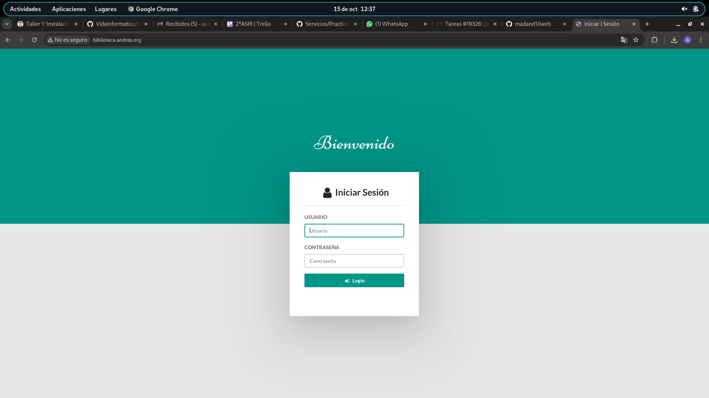
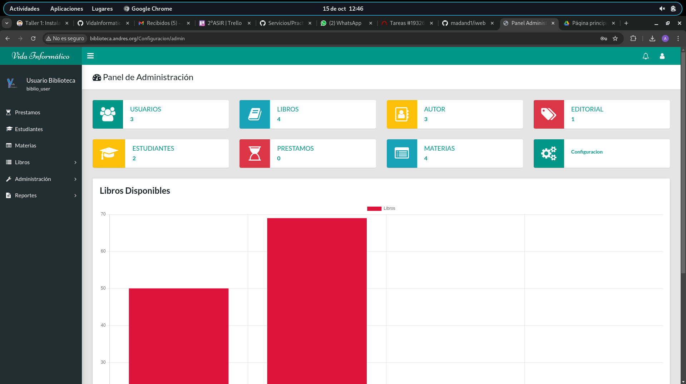
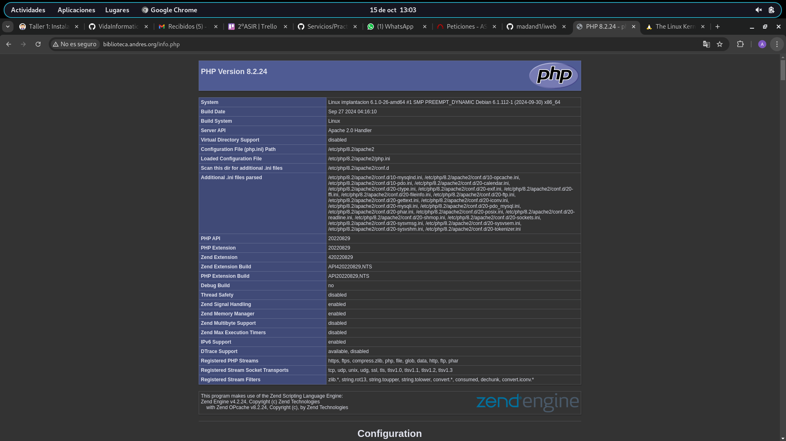

Lo primero que haremos sera desde la mauqina virtual crear un usuario y una base d ed atso:


```
andy@implantacion:~$ sudo mysql -u root -p
Enter password: 
Welcome to the MariaDB monitor.  Commands end with ; or \g.
Your MariaDB connection id is 31
Server version: 10.11.6-MariaDB-0+deb12u1 Debian 12

Copyright (c) 2000, 2018, Oracle, MariaDB Corporation Ab and others.

Type 'help;' or '\h' for help. Type '\c' to clear the current input statement.

MariaDB [(none)]> CREATE DATABASE biblioteca;
Query OK, 1 row affected (0,001 sec)

MariaDB [(none)]> CREATE USER 'biblio_user'@'localhost' IDENTIFIED BY 'password';
Query OK, 0 rows affected (0,007 sec)

MariaDB [(none)]> GRANT ALL PRIVILEGES ON biblioteca.* TO 'biblio_user'@'localhost';
Query OK, 0 rows affected (0,006 sec)

MariaDB [(none)]> FLUSH PRIVILEGES;
Query OK, 0 rows affected (0,001 sec)

MariaDB [(none)]> Ctrl-C -- exit!
Aborted
andy@implantacion:~$ 
```

Ahora lo que haremos sera clonar el repositorio este:

```
andy@implantacion: cd /var/www
andy@implantacion:/var/www$ sudo git clone https://github.com/VidaInformatico/Sistema-de-biblioteca-basico-php-8-y-mysql biblio
Clonando en 'biblio'...
remote: Enumerating objects: 230, done.
remote: Counting objects: 100% (230/230), done.
remote: Compressing objects: 100% (151/151), done.
Recibiendo objetos:  16% (37/230), 1.86 MiB | 709.00 KiB/s  

```

En el directorio :

seria tal que asi:

```
andy@implantacion:/var/www$ sudo git clone https://github.com/VidaInformatico/Sistema-de-biblioteca-basico-php-8-y-mysql biblio
Clonando en 'biblio'...
remote: Enumerating objects: 230, done.
remote: Counting objects: 100% (230/230), done.
remote: Compressing objects: 100% (151/151), done.
remote: Total 230 (delta 82), reused 218 (delta 77), pack-reused 0 (from 0)
Recibiendo objetos: 100% (230/230), 3.32 MiB | 862.00 KiB/s, listo.
Resolviendo deltas: 100% (82/82), listo.

```

Ahora vamso a aodificar el archivo config con los datos que se hayan creado, en lo siguiente.

```andy@implantacion:/var/www/biblio$ sudo nano Config/Config.php 
andy@implantacion:/var/www/biblio$ 
```

Estos son los datos modificados:

```
andy@implantacion:/var/www/biblio$ cat Config/Config.php 
<?php
const base_url = "http://biblioteca.andres.org/";
const host = "localhost";
const user = "biblio_user";
const pass = "password";
const db = "biblioteca";
const charset = "charset=utf8";
?>

```

Ahora vmso a configurar el virtual host

```
andy@implantacion:~$ cd /etc/apache2/sites-available/
andy@implantacion:/etc/apache2/sites-available$ ls
000-default.conf  default-ssl.conf  departamentos.conf  iesgn.conf
andy@implantacion:/etc/apache2/sites-available$ sudo nano biblioteca.conf
andy@implantacion:/etc/apache2/sites-available$ cat biblioteca.conf 
<VirtualHost *:80>
    ServerAdmin webmaster@biblioteca.andres.org
    ServerName biblioteca.andres.org
    DocumentRoot /var/www/biblio

    <Directory /var/www/biblio>
        AllowOverride All
        Require all granted
    </Directory>

    ErrorLog ${APACHE_LOG_DIR}/error.log
    CustomLog ${APACHE_LOG_DIR}/access.log combined
</VirtualHost>
andy@implantacion:/etc/apache2/sites-available$ 
```

Activo el nuevo VirtualHost y recargo Apache:

```
andy@implantacion:/etc/apache2/sites-available$ cd
andy@implantacion:~$ sudo a2en
a2enconf  a2enmod   a2ensite  
andy@implantacion:~$ sudo a2en
a2enconf  a2enmod   a2ensite  
andy@implantacion:~$ sudo a2ensite biblioteca.conf 
Enabling site biblioteca.
To activate the new configuration, you need to run:
  systemctl reload apache2
andy@implantacion:~$ sudo systemctl reload apache2

```

Importamos la base de datos:

```
andy@implantacion:~$ mysql -u biblio_user -p biblioteca < /var/www/biblio/biblioteca.sql
Enter password: 
andy@implantacion:~$ 

```

por ultimo modificamos los ficheros /etc/hosts tanto de la virtual como del host

en la vurtual

```
andy@implantacion:~$ cat /etc/hosts
127.0.0.1	localhost
127.0.1.1	implantacion
172.22.8.205	biblioteca.andres.org
# The following lines are desirable for IPv6 capable hosts
::1     localhost ip6-localhost ip6-loopback
ff02::1 ip6-allnodes
ff02::2 ip6-allrouters

```
En el host:

```
madandy@toyota-hilux:~$ cat /etc/hosts
127.0.0.1	localhost
127.0.1.1	toyota-hilux
172.22.8.205	biblioteca.andres.org

192.168.122.138	www.example.org
192.168.122.138 www.iesgn.com
192.168.122.138 www.departamentos.com
# The following lines are desirable for IPv6 capable hosts
::1     localhost ip6-localhost ip6-loopback
ff02::1 ip6-allnodes
ff02::2 ip6-allrouters

```

Despues de esto hayq ue habilitar el módulo, de la siguiente manera:

```
andy@implantacion:~$ sudo a2enmod rewrite
Enabling module rewrite.
To activate the new configuration, you need to run:
  systemctl restart apache2

See system logs and 'systemctl status apache2.service' for details.
andy@implantacion:~$ sudo systemctl restart apache2

```

vemos como sale por aqui en pantalla:



Como no podemos entrar tendremso que ir a la base de datos y poner lo siguiente:

```
andy@implantacion:~$ sudo mysql -u root -p
Enter password: 
Welcome to the MariaDB monitor.  Commands end with ; or \g.
Your MariaDB connection id is 48
Server version: 10.11.6-MariaDB-0+deb12u1 Debian 12

Copyright (c) 2000, 2018, Oracle, MariaDB Corporation Ab and others.

Type 'help;' or '\h' for help. Type '\c' to clear the current input statement.

MariaDB [(none)]> INSERT INTO usuarios (usuario, nombre, clave, estado) VALUES ('biblio_user', 'Usuario Biblioteca', SHA2('password',256), 1);
ERROR 1046 (3D000): No database selected
MariaDB [(none)]> use biblioteca;
Reading table information for completion of table and column names
You can turn off this feature to get a quicker startup with -A

Database changed
MariaDB [biblioteca]> INSERT INTO usuarios (usuario, nombre, clave, estado) VALUES ('biblio_user', 'Usuario Biblioteca', SHA2('password',256), 1);
Query OK, 1 row affected (0,005 sec)

MariaDB [biblioteca]> 


```
Y ahora si que nos deja entrar:



Una vez hecho esto haremos lo siguiente:

```
andy@implantacion:~$ sudo nano /etc/apache2/apache2.conf 
andy@implantacion:~$ sudo systemt restart apache2
sudo: systemt: command not found
andy@implantacion:~$ sudo systemctl restart apache2
andy@implantacion:~$ 
```

Si abrimos el archivo de configuracion tendremos que modificar lo sigiente a como esta esto:

```
<Directory /var/www/>
	Options Indexes FollowSymLinks
	AllowOverride All
	Require all granted
</Directory>


```

Para esta aplicación no es necesario, pero en determinadas aplicaciones es posible que necesitemos cambiar la memoria RAM que puede utilizar. Cambia la memoria máxima de uso de un script PHP (parámetro memory_limit) a 256Mb. ¿En qué fichero lo tienes que cambiar?.

Dentro del fichero /etc/php/8.2/apache2/php.ini 
```
; How many multipart body parts (combined input variable and file uploads) may
; be accepted.
; Default Value: -1 (Sum of max_input_vars and max_file_uploads)
;max_multipart_body_parts = 1500

; Maximum amount of memory a script may consume
; https://php.net/memory-limit
memory_limit = 256M

;;;;;;;;;;;;;;;;;;;;;;;;;;;;;;
; Error handling and logging ;
;;;;;;;;;;;;;;;;;;;;;;;;;;;;;;

; This directive informs PHP of which errors, warnings and notices you would like
```
Guardamos los cambios y reiniciamos Apache:

```sudo systemctl restart apache2```


Para mostrar el fichero info.php lo creamos:

```sudo nano /var/www/biblio/info.php```

Y agregamos el siguiente contenido:

```
<?php
phpinfo();
?>
```



