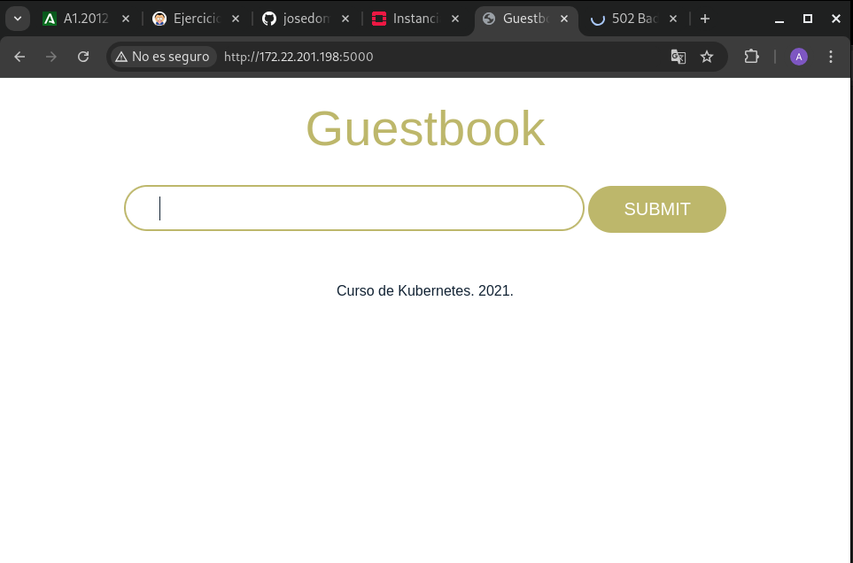
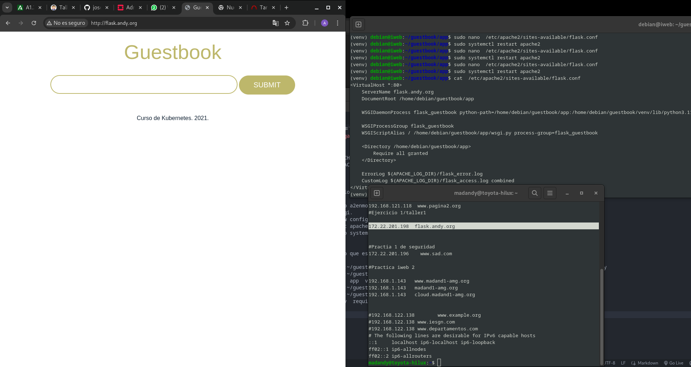

He creado una máquina virtual de una instancia en lo que esta en openstack:

pasos que llevo hasta ahora:_

madandy@toyota-hilux:~$ ssh debian@172.22.201.198
The authenticity of host '172.22.201.198 (172.22.201.198)' can't be established.
ED25519 key fingerprint is SHA256:4naIUEUeNtJZrJT/0btMg2Nlp2sbInlnXcraR/9yi7E.
This key is not known by any other names.
Are you sure you want to continue connecting (yes/no/[fingerprint])? yes
Warning: Permanently added '172.22.201.198' (ED25519) to the list of known hosts.
Linux iweb 6.1.0-26-amd64 #1 SMP PREEMPT_DYNAMIC Debian 6.1.112-1 (2024-09-30) x86_64

The programs included with the Debian GNU/Linux system are free software;
the exact distribution terms for each program are described in the
individual files in /usr/share/doc/*/copyright.

Debian GNU/Linux comes with ABSOLUTELY NO WARRANTY, to the extent
permitted by applicable law.
debian@iweb:~$ git clone git@github.com:josedom24/guestbook.git
-bash: git: command not found
debian@iweb:~$ sudo apt install git -y
Reading package lists... Done
Building dependency tree... Done
Reading state information... Done
E: Unable to locate package git
debian@iweb:~$ sudo apt updtae
E: Invalid operation updtae
debian@iweb:~$ sudo apt update 
Get:1 file:/etc/apt/mirrors/debian.list Mirrorlist [30 B]
Get:2 file:/etc/apt/mirrors/debian-security.list Mirrorlist [39 B]
Get:3 https://deb.debian.org/debian bookworm InRelease [151 kB]
Get:4 https://deb.debian.org/debian bookworm-updates InRelease [55.4 kB]
Get:5 https://deb.debian.org/debian bookworm-backports InRelease [59.0 kB]
Get:6 https://deb.debian.org/debian-security bookworm-security InRelease [48.0 kB]
Get:7 https://deb.debian.org/debian bookworm/main Sources [9494 kB]
Get:8 https://deb.debian.org/debian bookworm/main amd64 Packages [8789 kB]
Get:9 https://deb.debian.org/debian bookworm/main Translation-en [6109 kB]
Get:10 https://deb.debian.org/debian bookworm-updates/main Sources [1260 B]
Get:11 https://deb.debian.org/debian bookworm-updates/main amd64 Packages [2468 B]
Get:12 https://deb.debian.org/debian bookworm-updates/main Translation-en [2928 B]
Get:13 https://deb.debian.org/debian bookworm-backports/main Sources [296 kB]
Get:14 https://deb.debian.org/debian bookworm-backports/main amd64 Packages [262 kB]
Get:15 https://deb.debian.org/debian bookworm-backports/main Translation-en [218 kB]
Get:16 https://deb.debian.org/debian-security bookworm-security/main Sources [128 kB]
Get:17 https://deb.debian.org/debian-security bookworm-security/main amd64 Packages [205 kB]
Get:18 https://deb.debian.org/debian-security bookworm-security/main Translation-en [126 kB]
Fetched 25.9 MB in 5s (4973 kB/s)                          
Reading package lists... Done
Building dependency tree... Done
Reading state information... Done
46 packages can be upgraded. Run 'apt list --upgradable' to see them.
debian@iweb:~$ sudo apt install git -y
Reading package lists... Done
Building dependency tree... Done
Reading state information... Done
The following additional packages will be installed:
  git-man liberror-perl libgdbm-compat4 libperl5.36 patch perl
  perl-modules-5.36
Suggested packages:
  git-daemon-run | git-daemon-sysvinit git-doc git-email git-gui gitk gitweb
  git-cvs git-mediawiki git-svn ed diffutils-doc perl-doc
  libterm-readline-gnu-perl | libterm-readline-perl-perl make
  libtap-harness-archive-perl
The following NEW packages will be installed:
  git git-man liberror-perl libgdbm-compat4 libperl5.36 patch perl
  perl-modules-5.36
0 upgraded, 8 newly installed, 0 to remove and 46 not upgraded.
Need to get 16.8 MB of archives.
After this operation, 97.0 MB of additional disk space will be used.
Get:1 file:/etc/apt/mirrors/debian.list Mirrorlist [30 B]
Get:2 https://deb.debian.org/debian bookworm/main amd64 perl-modules-5.36 all 5.36.0-7+deb12u1 [2815 kB]
Get:3 https://deb.debian.org/debian bookworm/main amd64 libgdbm-compat4 amd64 1.23-3 [48.2 kB]
Get:4 https://deb.debian.org/debian bookworm/main amd64 libperl5.36 amd64 5.36.0-7+deb12u1 [4218 kB]
Get:5 https://deb.debian.org/debian bookworm/main amd64 perl amd64 5.36.0-7+deb12u1 [239 kB]
Get:6 https://deb.debian.org/debian bookworm/main amd64 liberror-perl all 0.17029-2 [29.0 kB]
Get:7 https://deb.debian.org/debian bookworm/main amd64 git-man all 1:2.39.5-0+deb12u1 [2054 kB]
Get:8 https://deb.debian.org/debian bookworm/main amd64 git amd64 1:2.39.5-0+deb12u1 [7256 kB]
Get:9 https://deb.debian.org/debian bookworm/main amd64 patch amd64 2.7.6-7 [128 kB]
Fetched 16.8 MB in 1s (19.5 MB/s)
Selecting previously unselected package perl-modules-5.36.
(Reading database ... 24347 files and directories currently installed.)
Preparing to unpack .../0-perl-modules-5.36_5.36.0-7+deb12u1_all.deb ...
Unpacking perl-modules-5.36 (5.36.0-7+deb12u1) ...
Selecting previously unselected package libgdbm-compat4:amd64.
Preparing to unpack .../1-libgdbm-compat4_1.23-3_amd64.deb ...
Unpacking libgdbm-compat4:amd64 (1.23-3) ...
Selecting previously unselected package libperl5.36:amd64.
Preparing to unpack .../2-libperl5.36_5.36.0-7+deb12u1_amd64.deb ...
Unpacking libperl5.36:amd64 (5.36.0-7+deb12u1) ...
Selecting previously unselected package perl.
Preparing to unpack .../3-perl_5.36.0-7+deb12u1_amd64.deb ...
Unpacking perl (5.36.0-7+deb12u1) ...
Selecting previously unselected package liberror-perl.
Preparing to unpack .../4-liberror-perl_0.17029-2_all.deb ...
Unpacking liberror-perl (0.17029-2) ...
Selecting previously unselected package git-man.
Preparing to unpack .../5-git-man_1%3a2.39.5-0+deb12u1_all.deb ...
Unpacking git-man (1:2.39.5-0+deb12u1) ...
Selecting previously unselected package git.
Preparing to unpack .../6-git_1%3a2.39.5-0+deb12u1_amd64.deb ...
Unpacking git (1:2.39.5-0+deb12u1) ...
Selecting previously unselected package patch.
Preparing to unpack .../7-patch_2.7.6-7_amd64.deb ...
Unpacking patch (2.7.6-7) ...
Setting up perl-modules-5.36 (5.36.0-7+deb12u1) ...
Setting up patch (2.7.6-7) ...
Setting up libgdbm-compat4:amd64 (1.23-3) ...
Setting up git-man (1:2.39.5-0+deb12u1) ...
Setting up libperl5.36:amd64 (5.36.0-7+deb12u1) ...
Setting up perl (5.36.0-7+deb12u1) ...
Setting up liberror-perl (0.17029-2) ...
Setting up git (1:2.39.5-0+deb12u1) ...
Processing triggers for man-db (2.11.2-2) ...
Processing triggers for libc-bin (2.36-9+deb12u8) ...
debian@iweb:~$ git clone git@github.com:josedom24/guestbook.git
Cloning into 'guestbook'...
The authenticity of host 'github.com (140.82.121.3)' can't be established.
ED25519 key fingerprint is SHA256:+DiY3wvvV6TuJJhbpZisF/zLDA0zPMSvHdkr4UvCOqU.
This key is not known by any other names.
Are you sure you want to continue connecting (yes/no/[fingerprint])? yes
Warning: Permanently added 'github.com' (ED25519) to the list of known hosts.
git@github.com: Permission denied (publickey).
fatal: Could not read from remote repository.

Please make sure you have the correct access rights
and the repository exists.
debian@iweb:~$ git clone https://github.com/josedom24/guestbook.git
Cloning into 'guestbook'...
remote: Enumerating objects: 36, done.
remote: Counting objects: 100% (36/36), done.
remote: Compressing objects: 100% (25/25), done.
remote: Total 36 (delta 10), reused 29 (delta 7), pack-reused 0 (from 0)
Receiving objects: 100% (36/36), 16.70 KiB | 397.00 KiB/s, done.
Resolving deltas: 100% (10/10), done.
debian@iweb:~$ sudo apt install redis
Reading package lists... Done
Building dependency tree... Done
Reading state information... Done
The following additional packages will be installed:
  libatomic1 liblzf1 redis-server redis-tools
Suggested packages:
  ruby-redis
The following NEW packages will be installed:
  libatomic1 liblzf1 redis redis-server redis-tools
0 upgraded, 5 newly installed, 0 to remove and 46 not upgraded.
Need to get 1106 kB of archives.
After this operation, 6284 kB of additional disk space will be used.
Do you want to continue? [Y/n] y
Get:1 file:/etc/apt/mirrors/debian.list Mirrorlist [30 B]
Get:2 https://deb.debian.org/debian bookworm/main amd64 libatomic1 amd64 12.2.0-14 [9328 B]
Get:3 https://deb.debian.org/debian bookworm/main amd64 liblzf1 amd64 3.6-3 [10.2 kB]
Get:4 https://deb.debian.org/debian bookworm/main amd64 redis-tools amd64 5:7.0.15-1~deb12u1 [989 kB]
Get:5 https://deb.debian.org/debian bookworm/main amd64 redis-server amd64 5:7.0.15-1~deb12u1 [72.4 kB]
Get:6 https://deb.debian.org/debian bookworm/main amd64 redis all 5:7.0.15-1~deb12u1 [24.6 kB]
Fetched 1106 kB in 1s (2004 kB/s)
Selecting previously unselected package libatomic1:amd64.
(Reading database ... 27464 files and directories currently installed.)
Preparing to unpack .../libatomic1_12.2.0-14_amd64.deb ...
Unpacking libatomic1:amd64 (12.2.0-14) ...
Selecting previously unselected package liblzf1:amd64.
Preparing to unpack .../liblzf1_3.6-3_amd64.deb ...
Unpacking liblzf1:amd64 (3.6-3) ...
Selecting previously unselected package redis-tools.
Preparing to unpack .../redis-tools_5%3a7.0.15-1~deb12u1_amd64.deb ...
Unpacking redis-tools (5:7.0.15-1~deb12u1) ...
Selecting previously unselected package redis-server.
Preparing to unpack .../redis-server_5%3a7.0.15-1~deb12u1_amd64.deb ...
Unpacking redis-server (5:7.0.15-1~deb12u1) ...
Selecting previously unselected package redis.
Preparing to unpack .../redis_5%3a7.0.15-1~deb12u1_all.deb ...
Unpacking redis (5:7.0.15-1~deb12u1) ...
Setting up liblzf1:amd64 (3.6-3) ...
Setting up libatomic1:amd64 (12.2.0-14) ...
Setting up redis-tools (5:7.0.15-1~deb12u1) ...
Setting up redis-server (5:7.0.15-1~deb12u1) ...
Created symlink /etc/systemd/system/redis.service → /lib/systemd/system/redis-s
erver.service.
Created symlink /etc/systemd/system/multi-user.target.wants/redis-server.servic
e → /lib/systemd/system/redis-server.service.
Setting up redis (5:7.0.15-1~deb12u1) ...
Processing triggers for man-db (2.11.2-2) ...
Processing triggers for libc-bin (2.36-9+deb12u8) ...
debian@iweb:~$ sudo apt install python3-flask -y
Reading package lists... Done
Building dependency tree... Done
Reading state information... Done
The following additional packages will be installed:
  libpython3.11-minimal libpython3.11-stdlib python3-distutils
  python3-lib2to3 python3-pip-whl python3-setuptools-whl python3.11
  python3.11-minimal python3.11-flask
Suggested packages:
  python3.11-doc binutils binfmt-support
The following NEW packages will be installed:
  python3-distutils python3-lib2to3 python3-pip-whl python3-setuptools-whl
  python3-flask python3.11-flask
The following packages will be upgraded:
  libpython3.11-minimal libpython3.11-stdlib python3.11 python3.11-minimal
4 upgraded, 6 newly installed, 0 to remove and 42 not upgraded.
Need to get 8293 kB of archives.
After this operation, 4193 kB of additional disk space will be used.
Get:1 file:/etc/apt/mirrors/debian.list Mirrorlist [30 B]
Get:2 https://deb.debian.org/debian bookworm/main amd64 python3.11 amd64 3.11.2-6+deb12u4 [573 kB]
Get:3 https://deb.debian.org/debian bookworm/main amd64 libpython3.11-stdlib amd64 3.11.2-6+deb12u4 [1797 kB]
Get:4 https://deb.debian.org/debian bookworm/main amd64 python3.11-minimal amd64 3.11.2-6+deb12u4 [2066 kB]
Get:5 https://deb.debian.org/debian bookworm/main amd64 libpython3.11-minimal amd64 3.11.2-6+deb12u4 [815 kB]
Get:6 https://deb.debian.org/debian bookworm/main amd64 python3-lib2to3 all 3.11.2-3 [76.3 kB]
Get:7 https://deb.debian.org/debian bookworm/main amd64 python3-distutils all 3.11.2-3 [131 kB]
Get:8 https://deb.debian.org/debian bookworm/main amd64 python3-pip-whl all 23.0.1+dfsg-1 [1717 kB]
Get:9 https://deb.debian.org/debian bookworm/main amd64 python3-setuptools-whl all 66.1.1-1 [1111 kB]
Get:10 https://deb.debian.org/debian bookworm/main amd64 python3.11-flask amd64 3.11.2-6+deb12u4 [5896 B]
Get:11 https://deb.debian.org/debian bookworm/main amd64 python3-flask amd64 3.11.2-1+b1 [1200 B]
Fetched 8293 kB in 1s (8341 kB/s)  
apt-listchanges: Reading changelogs...
(Reading database ... 27514 files and directories currently installed.)
Preparing to unpack .../0-python3.11_3.11.2-6+deb12u4_amd64.deb ...
Unpacking python3.11 (3.11.2-6+deb12u4) over (3.11.2-6+deb12u3) ...
Preparing to unpack .../1-libpython3.11-stdlib_3.11.2-6+deb12u4_amd64.deb ...
Unpacking libpython3.11-stdlib:amd64 (3.11.2-6+deb12u4) over (3.11.2-6+deb12u3)
 ...
Preparing to unpack .../2-python3.11-minimal_3.11.2-6+deb12u4_amd64.deb ...
Unpacking python3.11-minimal (3.11.2-6+deb12u4) over (3.11.2-6+deb12u3) ...
Preparing to unpack .../3-libpython3.11-minimal_3.11.2-6+deb12u4_amd64.deb ...
Unpacking libpython3.11-minimal:amd64 (3.11.2-6+deb12u4) over (3.11.2-6+deb12u3
) ...
Selecting previously unselected package python3-lib2to3.
Preparing to unpack .../4-python3-lib2to3_3.11.2-3_all.deb ...
Unpacking python3-lib2to3 (3.11.2-3) ...
Selecting previously unselected package python3-distutils.
Preparing to unpack .../5-python3-distutils_3.11.2-3_all.deb ...
Unpacking python3-distutils (3.11.2-3) ...
Selecting previously unselected package python3-pip-whl.
Preparing to unpack .../6-python3-pip-whl_23.0.1+dfsg-1_all.deb ...
Unpacking python3-pip-whl (23.0.1+dfsg-1) ...
Selecting previously unselected package python3-setuptools-whl.
Preparing to unpack .../7-python3-setuptools-whl_66.1.1-1_all.deb ...
Unpacking python3-setuptools-whl (66.1.1-1) ...
Selecting previously unselected package python3.11-flask.
Preparing to unpack .../8-python3.11-flask_3.11.2-6+deb12u4_amd64.deb ...
Unpacking python3.11-flask (3.11.2-6+deb12u4) ...
Selecting previously unselected package python3-flask.
Preparing to unpack .../9-python3-flask_3.11.2-1+b1_amd64.deb ...
Unpacking python3-flask (3.11.2-1+b1) ...
Setting up python3-setuptools-whl (66.1.1-1) ...
Setting up python3-pip-whl (23.0.1+dfsg-1) ...
Setting up libpython3.11-minimal:amd64 (3.11.2-6+deb12u4) ...
Setting up python3-lib2to3 (3.11.2-3) ...
Setting up python3-distutils (3.11.2-3) ...
Setting up python3.11-minimal (3.11.2-6+deb12u4) ...
Setting up libpython3.11-stdlib:amd64 (3.11.2-6+deb12u4) ...
Setting up python3.11 (3.11.2-6+deb12u4) ...
Setting up python3.11-flask (3.11.2-6+deb12u4) ...
Setting up python3-flask (3.11.2-1+b1) ...
Processing triggers for man-db (2.11.2-2) ...
Processing triggers for systemd (252.30-1~deb12u2) ...
debian@iweb:~$ ls
guestbook
debian@iweb:~$ cd guestbook/
debian@iweb:~/guestbook$ ls
LICENSE  README.md  app
debian@iweb:~/guestbook$ python3 -m venv flask
debian@iweb:~/guestbook$ source flask/bin/activate

# Hasta aqui llevo

(
(flask) debian@iweb:~/guestbook$ cd app/
(flask) debian@iweb:~/guestbook/app$ ls
app.py  requirements.txt  static  templates
(flask) debian@iweb:~/guestbook/app$ pip install -r requirements.txt
Collecting Flask
  Downloading flask-3.1.0-py3-none-any.whl (102 kB)
     ━━━━━━━━━━━━━━━━━━━━━━━━━━━━━━━━━━━━━━ 103.0/103.0 kB 1.4 MB/s eta 0:00:00
Collecting redis
  Downloading redis-5.2.0-py3-none-any.whl (261 kB)
     ━━━━━━━━━━━━━━━━━━━━━━━━━━━━━━━━━━━━━━ 261.4/261.4 kB 3.9 MB/s eta 0:00:00
Collecting Werkzeug>=3.1
  Downloading werkzeug-3.1.3-py3-none-any.whl (224 kB)
     ━━━━━━━━━━━━━━━━━━━━━━━━━━━━━━━━━━━━━━ 224.5/224.5 kB 8.7 MB/s eta 0:00:00
Collecting Jinja2>=3.1.2
  Downloading jinja2-3.1.4-py3-none-any.whl (133 kB)
     ━━━━━━━━━━━━━━━━━━━━━━━━━━━━━━━━━━━━━━ 133.3/133.3 kB 5.1 MB/s eta 0:00:00
Collecting itsdangerous>=2.2
  Downloading itsdangerous-2.2.0-py3-none-any.whl (16 kB)
Collecting click>=8.1.3
  Downloading click-8.1.7-py3-none-any.whl (97 kB)
     ━━━━━━━━━━━━━━━━━━━━━━━━━━━━━━━━━━━━━━━━ 97.9/97.9 kB 5.9 MB/s eta 0:00:00
Collecting blinker>=1.9
  Downloading blinker-1.9.0-py3-none-any.whl (8.5 kB)
Collecting async-timeout>=4.0.3
  Downloading async_timeout-5.0.1-py3-none-any.whl (6.2 kB)
Collecting MarkupSafe>=2.0
  Downloading MarkupSafe-3.0.2-cp311-cp311-manylinux_2_17_x86_64.manylinux2014_x86_64.whl (23 kB)
Installing collected packages: MarkupSafe, itsdangerous, click, blinker, async-timeout, Werkzeug, redis, Jinja2, Flask
Successfully installed Flask-3.1.0 Jinja2-3.1.4 MarkupSafe-3.0.2 Werkzeug-3.1.3 async-timeout-5.0.1 blinker-1.9.0 click-8.1.7 itsdangerous-2.2.0 redis-5.2.0
(flask) debian@iweb:~/guestbook/app$ 

Lo que tengo que hacer es poner la ip flotante, de la isntancia:

(flask) debian@iweb:~/guestbook/app$ python3 app.py 
 * Serving Flask app 'app'
 * Debug mode: on
WARNING: This is a development server. Do not use it in a production deployment. Use a production WSGI server instead.
 * Running on all addresses (0.0.0.0)
 * Running on http://127.0.0.1:5000
 * Running on http://10.0.0.18:5000
Press CTRL+C to quit
 * Restarting with stat
 * Debugger is active!
 * Debugger PIN: 101-965-450
172.22.12.34 - - [26/Nov/2024 08:43:29] "GET / HTTP/1.1" 200 -
172.22.12.34 - - [26/Nov/2024 08:43:29] "GET /static/style.css HTTP/1.1" 200 -
172.22.12.34 - - [26/Nov/2024 08:43:29] "GET /favicon.ico HTTP/1.1" 404 -
172.22.12.34 - - [26/Nov/2024 08:56:43] "GET / HTTP/1.1" 200 -
172.22.12.34 - - [26/Nov/2024 08:56:43] "GET /static/style.css HTTP/1.1" 304 -

y se veria tal que asi:

Hasta aqui el ejercicio:

## Listo compadre

# Taller 1: Desplegando aplicaciones flask con apache2 + mod_wsgi

Dentro del entorno:

(flask) debian@iweb:~/guestbook/app$ sudo apt install libapache2-mod-wsgi-py3
Reading package lists... Done
Building dependency tree... Done
Reading state information... Done
The following additional packages will be installed:
  apache2-bin libapr1 libaprutil1 libaprutil1-dbd-sqlite3 libaprutil1-ldap
  libjansson4 liblua5.3-0 libpython3.11
Suggested packages:
  apache2-doc apache2-suexec-pristine | apache2-suexec-custom www-browser
The following NEW packages will be installed:
  apache2-bin libapache2-mod-wsgi-py3 libapr1 libaprutil1
  libaprutil1-dbd-sqlite3 libaprutil1-ldap libjansson4 liblua5.3-0
  libpython3.11
0 upgraded, 9 newly installed, 0 to remove and 42 not upgraded.
Need to get 3851 kB of archives.
After this operation, 14.6 MB of additional disk space will be used.
Do you want to continue? [Y/n] y
Get:1 file:/etc/apt/mirrors/debian.list Mirrorlist [30 B]
Get:2 https://deb.debian.org/debian bookworm/main amd64 libapr1 amd64 1.7.2-3+deb12u1 [102 kB]
Get:3 https://deb.debian.org/debian bookworm/main amd64 libaprutil1 amd64 1.6.3-1 [87.8 kB]
Get:4 https://deb.debian.org/debian bookworm/main amd64 libaprutil1-dbd-sqlite3 amd64 1.6.3-1 [13.6 kB]
Get:5 https://deb.debian.org/debian bookworm/main amd64 libaprutil1-ldap amd64 1.6.3-1 [11.8 kB]
Get:6 https://deb.debian.org/debian bookworm/main amd64 libjansson4 amd64 2.14-2 [40.8 kB]
Get:7 https://deb.debian.org/debian bookworm/main amd64 liblua5.3-0 amd64 5.3.6-2 [123 kB]
Get:8 https://deb.debian.org/debian bookworm/main amd64 apache2-bin amd64 2.4.62-1~deb12u2 [1386 kB]
Get:9 https://deb.debian.org/debian bookworm/main amd64 libpython3.11 amd64 3.11.2-6+deb12u4 [1989 kB]
Get:10 https://deb.debian.org/debian bookworm/main amd64 libapache2-mod-wsgi-py3 amd64 4.9.4-1+b2 [97.3 kB]
Fetched 3851 kB in 11s (347 kB/s)                                             
Selecting previously unselected package libapr1:amd64.
(Reading database ... 27670 files and directories currently installed.)
Preparing to unpack .../0-libapr1_1.7.2-3+deb12u1_amd64.deb ...
Unpacking libapr1:amd64 (1.7.2-3+deb12u1) ...
Selecting previously unselected package libaprutil1:amd64.
Preparing to unpack .../1-libaprutil1_1.6.3-1_amd64.deb ...
Unpacking libaprutil1:amd64 (1.6.3-1) ...
Selecting previously unselected package libaprutil1-dbd-sqlite3:amd64.
Preparing to unpack .../2-libaprutil1-dbd-sqlite3_1.6.3-1_amd64.deb ...
Unpacking libaprutil1-dbd-sqlite3:amd64 (1.6.3-1) ...
Selecting previously unselected package libaprutil1-ldap:amd64.
Preparing to unpack .../3-libaprutil1-ldap_1.6.3-1_amd64.deb ...
Unpacking libaprutil1-ldap:amd64 (1.6.3-1) ...
Selecting previously unselected package libjansson4:amd64.
Preparing to unpack .../4-libjansson4_2.14-2_amd64.deb ...
Unpacking libjansson4:amd64 (2.14-2) ...
Selecting previously unselected package liblua5.3-0:amd64.
Preparing to unpack .../5-liblua5.3-0_5.3.6-2_amd64.deb ...
Unpacking liblua5.3-0:amd64 (5.3.6-2) ...
Selecting previously unselected package apache2-bin.
Preparing to unpack .../6-apache2-bin_2.4.62-1~deb12u2_amd64.deb ...
Unpacking apache2-bin (2.4.62-1~deb12u2) ...
Selecting previously unselected package libpython3.11:amd64.
Preparing to unpack .../7-libpython3.11_3.11.2-6+deb12u4_amd64.deb ...
Unpacking libpython3.11:amd64 (3.11.2-6+deb12u4) ...
Selecting previously unselected package libapache2-mod-wsgi-py3.
Preparing to unpack .../8-libapache2-mod-wsgi-py3_4.9.4-1+b2_amd64.deb ...
Unpacking libapache2-mod-wsgi-py3 (4.9.4-1+b2) ...
Setting up libpython3.11:amd64 (3.11.2-6+deb12u4) ...
Setting up libapr1:amd64 (1.7.2-3+deb12u1) ...
Setting up libjansson4:amd64 (2.14-2) ...
Setting up liblua5.3-0:amd64 (5.3.6-2) ...
Setting up libaprutil1:amd64 (1.6.3-1) ...
Setting up libaprutil1-ldap:amd64 (1.6.3-1) ...
Setting up libaprutil1-dbd-sqlite3:amd64 (1.6.3-1) ...
Setting up apache2-bin (2.4.62-1~deb12u2) ...
Setting up libapache2-mod-wsgi-py3 (4.9.4-1+b2) ...
Processing triggers for libc-bin (2.36-9+deb12u8) ...
Processing triggers for man-db (2.11.2-2) ...
(flask) debian@iweb:~/guestbook/app$ 

ahora hago lo que es mi virtualhosts:

debian@iweb:~$ cat /etc/apache2/sites-available/flask.conf
<VirtualHost *:80>
    ServerName flask.andy.org
    DocumentRoot /home/debian/guestbook/app
    
    WSGIDaemonProcess flask_guestbook python-path=/home/debian/guestbook/app:/home/debian/guestbook/flask/lib/python3.11/site-packages
    
    WSGIProcessGroup flask_guestbook
    WSGIScriptAlias / /home/debian/guestbook/app/wsgi.py process-group=flask_guestbook
    
    <Directory /home/debian/guestbook/app>
	Require all granted
    </Directory>
    
    ErrorLog ${APACHE_LOG_DIR}/flask_error.log
    CustomLog ${APACHE_LOG_DIR}/flask_access.log combined
</VirtualHost>

y despues hacemos lo siguiente:

debian@iweb:~$ sudo a2enmod wsgi
Enabling module wsgi.
To activate the new configuration, you need to run:
  systemctl restart apache2
debian@iweb:~$ sudo systemctl restart apache2.service 
debian@iweb:~$ 

Aqui he cambiado lo que es wsgi.py al directorio app:
debian@iweb:~$ cd guestbook/
debian@iweb:~/guestbook$ source flask/bin/activate

(flask) debian@iweb:~/guestbook$ sudo mv /home/debian/guestbook/wsgi.py /home/debian/guestbook/app/wsgi.py
(flask) debian@iweb:~/guestbook$ ls
LICENSE  README.md  app  flask
(flask) debian@iweb:~/guestbook$ cd app/
(flask) debian@iweb:~/guestbook/app$ ls
__pycache__  app.py  requirements.txt  static  templates  wsgi.py

ahora accedemos a la url que tenemos en servername, y listo ya se veria:

# Taller 2: Desplegando aplicaciones flask con apache2/nginx + uwsgi

(flask) debian@iweb:~/guestbook/app$ pip install python3-dev -y

(flask) debian@iweb:~/guestbook/app$ pip install build-essential -y

(flask) debian@iweb:~/guestbook/app$ pip install uwsgi

(flask) debian@iweb:~$ sudo nano /etc/systemd/system/uwsgi-guestbook.service

dentro del fichero esta:
(flask) debian@iweb:~$ cat /etc/systemd/system/uwsgi-guestbook.service
[Unit]
Description=uwsgi-guestbook
After=network.target
[Install]
WantedBy=multi-user.target
[Service]
User=www-data
Group=www-data
Restart=always
ExecStart=/home/debian/flask/bin/uwsgi /home/debian/flask/ejemplo.ini
ExecReload=/bin/kill -s HUP $MAINPID
ExecStop=/bin/kill -s TERM $MAINPID
WorkingDirectory=/home/debian/guestbook
Environment=PYTHONPATH='/home/debian/guestbook:/home/debian/flask/lib/python3.11/site-packages'
PrivateTmp=true

(flask) debian@iweb:~$ systemctl enable uwsgi-guestbook.service
==== AUTHENTICATING FOR org.freedesktop.systemd1.manage-unit-files ====
Authentication is required to manage system service or unit files.
Authenticating as: Debian (debian)
Password: 
(flask) debian@iweb:~$ sudo systemctl enable uwsgi-guestbook.service
Created symlink /etc/systemd/system/multi-user.target.wants/uwsgi-guestbook.service → /etc/systemd/system/uwsgi-guestbook.service.
(flask) debian@iweb:~$ sudo systemctl start uwsgi-guestbook.service

/home/debian/guestbook/flask/bin/uwsgi
/home/debian/guestbook/flask/ejemeplo.ini
