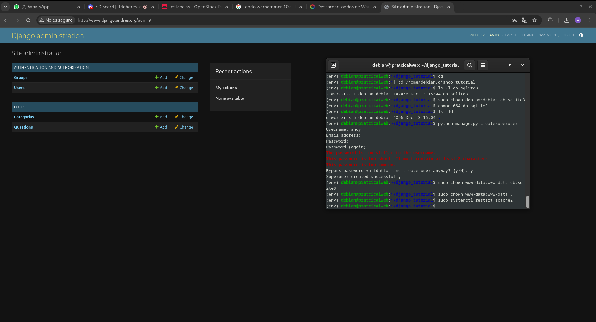
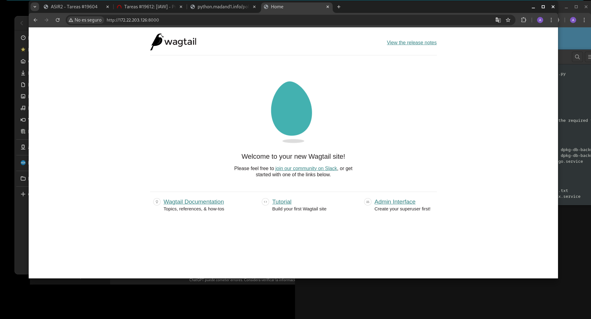
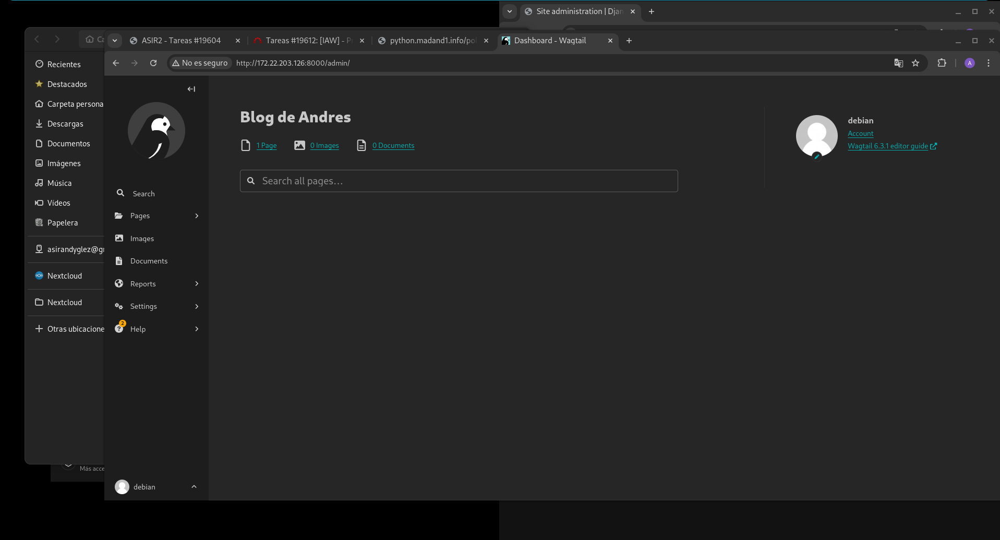
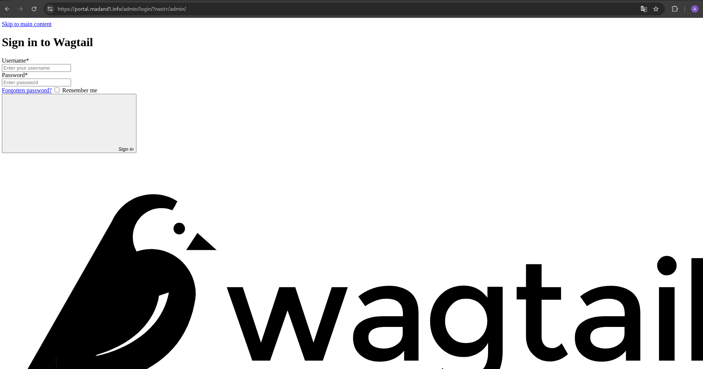

(env) debian@ford-raptor:~/django_tutorial/django_tutorial$ cat /etc/nginx/sites-available/django 
server {
server_name python.madand1.info;
root /home/debian/django_tutorial/django_tutorial;
# Proxy para Django con uWSGI
location / {
include uwsgi_params;
uwsgi_pass 127.0.0.1:8001;
}
# Alias para los archivos estáticos de administración
location /static/admin {
	alias /home/debian/env/lib/python3.11/site-packages/django/contrib/admin/static/admin;

}

# Alias para los archivos estáticos de "polls"
location /static/polls {
		alias /home/debian/django_tutorial/polls/static/polls;

}

error_log /var/log/nginx/django_tutorial_error.log;
access_log /var/log/nginx/django_tutorial_access.log;

# Gestión del alias principal
	location @django {
		include uwsgi_params;
		uwsgi_pass 127.0.0.1:8001;
	}

    listen 443 ssl; # managed by Certbot
    ssl_certificate /etc/letsencrypt/live/python.madand1.info/fullchain.pem; # managed by Certbot
    ssl_certificate_key /etc/letsencrypt/live/python.madand1.info/privkey.pem; # managed by Certbot
    include /etc/letsencrypt/options-ssl-nginx.conf; # managed by Certbot
    ssl_dhparam /etc/letsencrypt/ssl-dhparams.pem; # managed by Certbot

}
server {
    if ($host = python.madand1.info) {
        return 301 https://$host$request_uri;
    } # managed by Certbot


listen 80;
server_name python.madand1.info;
    return 404; # managed by Certbot


}


1.  obtengo el certificado para mi dominio:
(env) debian@ford-raptor:~/ sudo certbot --nginx -d python.madand1.info
Saving debug log to /var/log/letsencrypt/letsencrypt.log
Requesting a certificate for python.madand1.info

Successfully received certificate.
Certificate is saved at: /etc/letsencrypt/live/python.madand1.info/fullchain.pem
Key is saved at:         /etc/letsencrypt/live/python.madand1.info/privkey.pem
This certificate expires on 2025-03-02.
These files will be updated when the certificate renews.
Certbot has set up a scheduled task to automatically renew this certificate in the background.

Deploying certificate
Successfully deployed certificate for python.madand1.info to /etc/nginx/sites-enabled/django
Congratulations! You have successfully enabled HTTPS on https://python.madand1.info

- - - - - - - - - - - - - - - - - - - - - - - - - - - - - - - - - - - - - - - -
If you like Certbot, please consider supporting our work by:
 * Donating to ISRG / Let's Encrypt:   https://letsencrypt.org/donate
 * Donating to EFF:                    https://eff.org/donate-le
- - - - - - - - - - - - - - - - - - - - - - - - - - - - - - - - - - - - - - - -
(env) debian@ford-raptor:~/


# Práctica 2 / 2: Instalación/migración de aplicaciones web Python
## Modificación de nuestra aplicación

h1. Cambiamos el index.html para que aparezca mi nombre:

<pre>
debian@pratcicaiweb:~$ cat django_tutorial/polls/templates/polls/index.html

<link rel="stylesheet" type="text/css" href="">
<h1>Encuestas del todopoderoso Andrés Morales González</h1>

    <ul>
    
    <li><a href="">{{ question.question_text }}</a></li>
    
    </ul>

    <p>No polls are available.</p>


</pre>

h2. Pasamos la imagen que usaremos de ```python

<pre>
madandy@toyota-hilux:~/Descargas$ 
scp fondo.webp debian@172.22.203.126:/home/debian/django_tutorial/polls/static/polls/images/
fondo.webp  
</pre>

h2. Modificaremos el fichero style.css:

<pre>
debian@pratcicaiweb:~/django_tutorial/polls/static/polls$ cat style.css 
li a {
    color: green;
    background-color: blanchedalmond;
}

body {
   background: white url("/static/polls/images/fondo.webp") no-repeat center center fixed;
    background-size: cover;
    margin: 0;
    padding: 0;

}

</pre>

y reiniciamos apache

<pre>
sudo systemctl apache2

</pre>

y se veria tal que asi:


h2. Añadimos una nueva tabla a la base de datos:

<pre>
debian@pratcicaiweb:~/django_tutorial/polls$ cat models.py 
import datetime

from django.db import models
from django.utils import timezone


class Question(models.Model):
    question_text = models.CharField(max_length=200)
    pub_date = models.DateTimeField('date published')

    def __str__(self):
        return self.question_text

    def was_published_recently(self):
        now = timezone.now()
        return now - datetime.timedelta(days=1) <= self.pub_date <= now
    was_published_recently.admin_order_field = 'pub_date'
    was_published_recently.boolean = True
    was_published_recently.short_description = 'Published recently?'


class Choice(models.Model):
    question = models.ForeignKey(Question, on_delete=models.CASCADE)
    choice_text = models.CharField(max_length=200)
    votes = models.IntegerField(default=0)

    def __str__(self):
        return self.choice_text

class Categoria(models.Model:
        Abr = models.CharField(max_length=4)
        Nombre = models.CharField(max_length=50)
        def __str__(self):
                return self.Abr+" - "+self.Nombre

</pre>

h2. Ceo una nueva mirgracion

<pre>
(env) debian@pratcicaiweb:~/django_tutorial$ python manage.py makemigrations
Migrations for 'polls':
  polls/migrations/0002_categoria.py
    - Create model Categoria

</pre>

h2. Realizo la migración

<pre>
(env) debian@pratcicaiweb:~/django_tutorial$ python manage.py migrate
Operations to perform:
  Apply all migrations: admin, auth, contenttypes, polls, sessions
Running migrations:
  Applying polls.0002_categoria... OK

</pre>

h2. Añadimos el nuevo modelo al sistio de administracion de django, en el fichero admin.py de la siguente manera:

<pre>
(env) debian@pratcicaiweb:~/django_tutorial/polls$ cat admin.py 
from django.contrib import admin

from .models import Choice, Question

from .models import Choice, Question, Categoria
admin.site.register(Categoria)

class ChoiceInline(admin.TabularInline):
    model = Choice
    extra = 3


class QuestionAdmin(admin.ModelAdmin):
    fieldsets = [
        (None,               {'fields': ['question_text']}),
        ('Date information', {'fields': [
         'pub_date'], 'classes': ['collapse']}),
    ]
    inlines = [ChoiceInline]
    list_display = ('question_text', 'pub_date', 'was_published_recently')
    list_filter = ['pub_date']
    search_fields = ['question_text']


admin.site.register(Question, QuestionAdmin)

</pre>

h2. Reinicio apache y vemos que se ha creado
el usuario es debian/usuario



h2. Subimos los cambios al repo de Github

<pre>
(env) debian@pratcicaiweb:~/django_tutorial$ git config --global --add safe.directory /home/debian/django_tutorial
(env) debian@pratcicaiweb:~/django_tutorial$ git add .
(env) debian@pratcicaiweb:~/django_tutorial$ git commit -m "Modificacion de la app"
[master 44270c7] Modificacion de la app
 8 files changed, 51 insertions(+), 4 deletions(-)
 create mode 100644 backup.json
 create mode 100644 polls/migrations/0002_categoria.py
 create mode 100644 polls/static/polls/images/fondo.webp
 create mode 100644 polls/templates/polls/index.html.save
(env) debian@pratcicaiweb:~/django_tutorial$ git push origin master 
Username for 'https://github.com': madand1
Password for 'https://madand1@github.com': 
Enumerating objects: 29, done.
Counting objects: 100% (29/29), done.
Compressing objects: 100% (16/16), done.
Writing objects: 100% (17/17), 94.95 KiB | 18.99 MiB/s, done.
Total 17 (delta 5), reused 0 (delta 0), pack-reused 0
remote: Resolving deltas: 100% (5/5), completed with 4 local objects.
To https://github.com/madand1/django_tutorial.git
   dd513ac..44270c7  master -> master
(env) debian@pratcicaiweb:~/django_tutorial$ 

</pre>

h2. Sincronizo el entorno de produccion

<pre>
(env) debian@ford-raptor:~/django_tutorial$ git pull origin master 
From https://github.com/madand1/django_tutorial
 * branch            master     -> FETCH_HEAD
Updating dd513ac..44270c7
Fast-forward
 backup.json                           |   1 +
 polls/admin.py                        |   2 ++
 polls/migrations/0002_categoria.py    |  21 +++++++++++++++++++++
 polls/models.py                       |   7 +++++++
 polls/static/polls/images/fondo.webp  | Bin 0 -> 93774 bytes
 polls/static/polls/style.css          |   6 +++++-
 polls/templates/polls/index.html      |   5 ++---
 polls/templates/polls/index.html.save |  13 +++++++++++++
 8 files changed, 51 insertions(+), 4 deletions(-)
 create mode 100644 backup.json
 create mode 100644 polls/migrations/0002_categoria.py
 create mode 100644 polls/static/polls/images/fondo.webp
 create mode 100644 polls/templates/polls/index.html.save

</pre>

h2. realizo la migracuion

<pre>
(env) debian@ford-raptor:~/django_tutorial$ python manage.py migrate
Operations to perform:
  Apply all migrations: admin, auth, contenttypes, polls, sessions
Running migrations:
  Applying polls.0002_categoria... OK

</pre>

h2. Reinicio los servicios

<pre>
(env) debian@ford-raptor:~/django_tutorial$ sudo systemctl restart nginx.service 
(env) debian@ford-raptor:~/django_tutorial$ sudo systemctl restart django.service 

</pre>

/home/madandy/Imágenes/Capturas de pantalla/espectacular.png

# Instalacion/migración de un CMS Python Django

h2. Creo un nuevo entorno virtual en desarrollo

<pre>
debian@pratcicaiweb:~$ python3 -m venv wagtail
debian@pratcicaiweb:~$ source wagtail/bin/activate
</pre>

h2. Isntalamos el cms wagtail
<pre>
(wagtail) debian@pratcicaiweb:~$ pip install wagtail
Collecting wagtail
  Downloading wagtail-6.3.1-py3-none-any.whl (9.1 MB)
     ━━━━━━━━━━━━━━━━━━━━━━━━━━━━━━━━━━━━━━━━ 9.1/9.1 MB 7.3 MB/s eta 0:00:00
Collecting Django<6.0,>=4.2
  Downloading Django-5.1.3-py3-none-any.whl (8.3 MB)
     ━━━━━━━━━━━━━━━━━━━━━━━━━━━━━━━━━━━━━━━━ 8.3/8.3 
</pre>

h2. Creamos un nuevo proyecto usando el cms wagtail

<pre>
(wagtail) debian@pratcicaiweb:~$ wagtail start mysite
Creating a Wagtail project called mysite using the default Wagtail template
Success! mysite has been created

</pre>

h2. Instalamos las dependencias necesarias que encontramos en el fichero requirements.txt:

<pre>
wagtail) debian@pratcicaiweb:~/mysite$ pip install -r requirements.txt 
Requirement already satisfied: Django<5.2,>=5.1 in /home/debian/wagtail/lib/python3.11/site-packages (from -r requirements.txt (line 1)) (5.1.3)

</pre>

h2. 5. Ejecutamos el comando migrate para incorporar las migraciones:

<pre>
(wagtail) debian@pratcicaiweb:~/mysite$ python manage.py migrate
Operations to perform:
  Apply all migrations: admin, auth, contenttypes, home, sessions, taggit, wagtailadmin, wagtailcore, wagtaildocs, wagtailembeds, wagtailforms, wagtailimages, wagtailredirects, wagtailsearch, wagtailusers
Running migrations:
  Applying contenttypes.0001_initial... OK
  Applying auth.0001_initial... OK

</pre>

h2. Comprobamos que la aplicación funciona correctamente a través de nuestro entorno virtual

<pre>
(wagtail) debian@pratcicaiweb:~/mysite$ python manage.py runserver 0.0.0.0:8000
Watching for file changes with StatReloader
Performing system checks...

System check identified no issues (0 silenced).
December 03, 2024 - 16:02:32
Django version 5.1.3, using settings 'mysite.settings.dev'
Starting development server at http://0.0.0.0:8000/
Quit the server with CONTROL-C.

[03/Dec/2024 16:02:41] "GET / HTTP/1.1" 200 6798
[03/Dec/2024 16:02:41] "GET /static/css/mysite.css HTTP/1.1" 200 0
[03/Dec/2024 16:02:41] "GET /static/css/welcome_page.css HTTP/1.1" 200 2522
[03/Dec/2024 16:02:41] "GET /static/js/mysite.js HTTP/1.1" 200 0
Not Found: /favicon.ico
[03/Dec/2024 16:02:41] "GET /favicon.ico HTTP/1.1" 404 3939

</pre>




h2. Creamos un usuario adminitsrador

</pre>
(wagtail) debian@iweb:~/mysite$ python manage.py createsuperuser
Username (leave blank to use 'debian'): 
Email address: 
Password: 
Password (again): 
The password is too similar to the username.
This password is too short. It must contain at least 8 characters.
Bypass password validation and create user anyway? [y/N]: y
Superuser created successfully.
</pre>

h2. . Para cambiar el nombre de nuestro blog, configuraremos el fichero mysite/settings/base.py:


<pre>
(wagtail) debian@pratcicaiweb:~/mysite/mysite/settings$ sudo nano base.py 

WAGTAIL_SITE_NAME = "Blog de Andrés" 
</pre>




h2. Para comenzar con la migración, utilizaremos el comando makemigrations

<pre>
(wagtail) debian@pratcicaiweb:~/mysite$ python manage.py makemigrations
No changes detected
(wagtail) debian@pratcicaiweb:~/mysite$ python manage.py migrate
Operations to perform:
  Apply all migrations: admin, auth, contenttypes, home, sessions, taggit, wagtailadmin, wagtailcore, wagtaildocs, wagtailembeds, wagtailforms, wagtailimages, wagtailredirects, wagtailsearch, wagtailusers
Running migrations:
  No migrations to apply.

</pre>

h2. Clonaremos un repositorio de Github vacío en nuestra máquina, moveremos nuestro proyecto a él y subiremos los archivos:

<pre>
(wagtail) debian@pratcicaiweb:~$ git clone https://github.com/madand1/wagtail-andy.git
Cloning into 'wagtail-andy'...
remote: Enumerating objects: 3, done.
remote: Counting objects: 100% (3/3), done.
remote: Total 3 (delta 0), reused 0 (delta 0), pack-reused 0 (from 0)
Receiving objects: 100% (3/3), done.
(wagtail) debian@pratcicaiweb:~$ sudo mv mysite/ wagtail
wagtail/      wagtail-andy/ 
(wagtail) debian@pratcicaiweb:~$ sudo mv mysite/ wagtail-andy/
(wagtail) debian@pratcicaiweb:~$ cd wagtail-andy/
.git/   mysite/ 
(wagtail) debian@pratcicaiweb:~$ cd wagtail-andy/mysite/
(wagtail) debian@pratcicaiweb:~/wagtail-andy/mysite$ sudo mv * ~/wagtail-andy/
mv: cannot move 'mysite' to '/home/debian/wagtail-andy/mysite': Directory not empty
(wagtail) debian@pratcicaiweb:~/wagtail-andy/mysite$ ls
mysite
(wagtail) debian@pratcicaiweb:~/wagtail-andy/mysite$ cd mysite/
(wagtail) debian@pratcicaiweb:~/wagtail-andy/mysite/mysite$ ls
__init__.py  __pycache__  settings  static  templates  urls.py  wsgi.py
(wagtail) debian@pratcicaiweb:~/wagtail-andy/mysite/mysite$ cd ..
(wagtail) debian@pratcicaiweb:~/wagtail-andy/mysite$ cd ..
(wagtail) debian@pratcicaiweb:~/wagtail-andy$ cd
(wagtail) debian@pratcicaiweb:~$ ls
django_tutorial  env  wagtail  wagtail-andy
(wagtail) debian@pratcicaiweb:~$ wagtail-andy/
-bash: wagtail-andy/: Is a directory
(wagtail) debian@pratcicaiweb:~$ cd wagtail-andy/
(wagtail) debian@pratcicaiweb:~/wagtail-andy$ ls
Dockerfile  db.sqlite3  manage.py  requirements.txt
README.md   home        mysite     search
(wagtail) debian@pratcicaiweb:~/wagtail-andy$ git add .
(wagtail) debian@pratcicaiweb:~/wagtail-andy$ git commit -m "app instalada"
[main ad553f9] app instalada
 41 files changed, 878 insertions(+)
 create mode 100644 Dockerfile
 create mode 100644 db.sqlite3
 create mode 100644 home/__init__.py
 create mode 100644 home/__pycache__/__init__.cpython-311.pyc
 create mode 100644 home/__pycache__/models.cpython-311.pyc
 create mode 100644 home/migrations/0001_initial.py
 create mode 100644 home/migrations/0002_create_homepage.py
 create mode 100644 home/migrations/__init__.py
 create mode 100644 home/migrations/__pycache__/0001_initial.cpython-311.pyc
 create mode 100644 home/migrations/__pycache__/0002_create_homepage.cpython-311.pyc
 create mode 100644 home/migrations/__pycache__/__init__.cpython-311.pyc
 create mode 100644 home/models.py
 create mode 100644 home/static/css/welcome_page.css
 create mode 100644 home/templates/home/home_page.html
 create mode 100644 home/templates/home/welcome_page.html
 create mode 100755 manage.py
 create mode 100644 mysite/.dockerignore
 create mode 100644 mysite/mysite/__init__.py
 create mode 100644 mysite/mysite/__pycache__/__init__.cpython-311.pyc
 create mode 100644 mysite/mysite/__pycache__/urls.cpython-311.pyc
 create mode 100644 mysite/mysite/__pycache__/wsgi.cpython-311.pyc
 create mode 100644 mysite/mysite/settings/__init__.py
 create mode 100644 mysite/mysite/settings/__pycache__/__init__.cpython-311.pyc
 create mode 100644 mysite/mysite/settings/__pycache__/base.cpython-311.pyc
 create mode 100644 mysite/mysite/settings/__pycache__/dev.cpython-311.pyc
 create mode 100644 mysite/mysite/settings/base.py
 create mode 100644 mysite/mysite/settings/dev.py
 create mode 100644 mysite/mysite/settings/production.py
 create mode 100644 mysite/mysite/static/css/mysite.css
 create mode 100644 mysite/mysite/static/js/mysite.js
 create mode 100644 mysite/mysite/templates/404.html
 create mode 100644 mysite/mysite/templates/500.html
 create mode 100644 mysite/mysite/templates/base.html
 create mode 100644 mysite/mysite/urls.py
 create mode 100644 mysite/mysite/wsgi.py
 create mode 100644 requirements.txt
 create mode 100644 search/__init__.py
 create mode 100644 search/__pycache__/__init__.cpython-311.pyc
 create mode 100644 search/__pycache__/views.cpython-311.pyc
 create mode 100644 search/templates/search/search.html
 create mode 100644 search/views.py
(wagtail) debian@pratcicaiweb:~/wagtail-andy$ git push origin main 
Username for 'https://github.com': madand1
Password for 'https://madand1@github.com': 
Enumerating objects: 59, done.
Counting objects: 100% (59/59), done.
Compressing objects: 100% (49/49), done.
Writing objects: 100% (58/58), 51.79 KiB | 3.70 MiB/s, done.
Total 58 (delta 4), reused 0 (delta 0), pack-reused 0
remote: Resolving deltas: 100% (4/4), done.
To https://github.com/madand1/wagtail-andy.git
   62952ef..ad553f9  main -> main
(wagtail) debian@pratcicaiweb:~/wagtail-andy$ 

</pre>

h2. Clonaremos este repositorio en nuestro entorno de producción:

<pre>
debian@ford-raptor:~$ git clone https://github.com/madand1/wagtail-andy.git
Cloning into 'wagtail-andy'...
remote: Enumerating objects: 61, done.
remote: Counting objects: 100% (61/61), done.
remote: Compressing objects: 100% (46/46), done.
remote: Total 61 (delta 4), reused 58 (delta 4), pack-reused 0 (from 0)
Receiving objects: 100% (61/61), 52.61 KiB | 1.17 MiB/s, done.
Resolving deltas: 100% (4/4), done.

</pre>

h2. Creo un entorno el virtal

<pre>
debian@ford-raptor:~$ python3 -m venv /home/debian/wagtail-andy/
debian@ford-raptor:~$ source /home/debian/wagtail-andy/bin/activate
(wagtail-andy) debian@ford-raptor:~$ 

</pre>

h2. Instalamos las dependencias

<pre>
(wagtail-andy) debian@ford-raptor:~/wagtail-andy$  pip install -r requirements.txt
Collecting Django<5.2,>=5.1
  Downloading Django-5.1.3-py3-none-any.whl (8.3 MB)
     ━━━━━━━━━━━━━━━━━━━━━━━━━━━━━━━━━━━━━━━━ 8.3/8.3 MB 62.5 MB/s eta 0:00:00
Collecting wagtail<6.4,>=6.3
  Downloading wagtail-6.3.1-py3-none-any.whl (9.1 MB)
     ━━━━━━━━━━━━━━━━━━━━━━━━━━━━━━━━━━━━━━━━ 9.1/9.1 MB 81.5 MB/s eta 0:00:00
Collecting asgiref<4,>=3.8.1
  Using cached asgiref-3.8.1-py3-none-any.whl (23 kB)
Collecting sqlparse>=0.3.1
  Using cached sqlparse-0.5.2-py3-none-any
</pre>

h2. Instalamos el módulo que permite que python trabaje con mysql:

<pre>
(wagtail-andy) debian@ford-raptor:~/wagtail-andy$ pip install mysqlclient
Collecting mysqlclient
  Using cached mysqlclient-2.2.6-cp311-cp311-linux_x86_64.whl
Installing collected packages: mysqlclient
Successfully installed mysqlclient-2.2.6

</pre>

h2. Creamos una nueva base de datos y usuario 

<pre>
(wagtail-andy) debian@ford-raptor:~/wagtail-andy$ sudo mariadb -u root -p
[sudo] password for debian: 
Sorry, try again.
[sudo] password for debian: 
Enter password: 
Welcome to the MariaDB monitor.  Commands end with ; or \g.
Your MariaDB connection id is 261
Server version: 10.11.6-MariaDB-0+deb12u1 Debian 12

Copyright (c) 2000, 2018, Oracle, MariaDB Corporation Ab and others.

Type 'help;' or '\h' for help. Type '\c' to clear the current input statement.

MariaDB [(none)]> CREATE DATABASE wagtail;
Query OK, 1 row affected (0.002 sec)

MariaDB [(none)]> CREATE USER 'wagtail'@'localhost' IDENTIFIED BY 'usuario';
Query OK, 0 rows affected (0.006 sec)

MariaDB [(none)]> GRANT ALL PRIVILEGES ON wagtail.* TO 'wagtail'@'localhost';
Query OK, 0 rows affected (0.001 sec)

MariaDB [(none)]> FLUSH PRIVILEGES;
Query OK, 0 rows affected (0.002 sec)

</pre>

h2. Configuramos la base de datos que acabamos de crear en el archivo wagtail_mysite/mysite/settings/base.py:

<pre>
DATABASES = {
    'default': {
        'ENGINE': 'django.db.backends.mysql',
        'NAME': 'wagtail',
        'USER': 'wagtail',
        'PASSWORD': 'usuario',
        'HOST': 'localhost',
        'PORT': '3306',
    } 
}

</pre>

h2. Ejecutamos la migracion

<pre>
wagtail-andy) debian@ford-raptor:~/wagtail-andy$ python manage.py migrate
System check identified some issues:

WARNINGS:
wagtailcore.WorkflowState: (models.W036) MariaDB does not support unique constraints with conditions.
	HINT: A constraint won't be created. Silence this warning if you don't care about it.
Operations to perform:
  Apply all migrations: admin, auth, contenttypes, home, sessions, taggit, wagtailadmin, wagtailcore, wagtaildocs, wagtailembeds, wagtailforms, wagtailimages, wagtailredirects, wagtailsearch, wagtailusers
Running migrations:
  Applying contenttypes.0001_initial... OK
  Applying auth.0001_initial... OK
  Applying admin.0001_initial... OK
  Applying admin.0002_logentry_remove_auto_add... OK
  Applying admin.0003_logentry_add_action_flag_choices... OK
  Applying contenttypes.0002_remove_content_type_name... OK
  Applying auth.0002_alter_permission_name_max_length... OK
  Applying auth.0003_alter_user_email_max_length... OK
  Applying auth.0004_alter_user_username_opts... OK

</pre>

h2. Instalamos el módulo uwsgi:

<pre>
(wagtail-andy) debian@ford-raptor:~/wagtail-andy$  pip install uwsgigi
Collecting uwsgi
  Using cached uwsgi-2.0.28.tar.gz (816 kB)
  Preparing metadata (setup.py) ... done
Installing col

...
..
</pre>

h2. Como esta aplicación no utiliza un fichero settings.py, vamos a configurar este:

<pre>
(wagtail-andy) debian@ford-raptor:~/wagtail-andy/mysite/settings$ cat production.py 
from .base import *
DEBUG = False
# SECURITY WARNING: keep the secret key used in production secret!
SECRET_KEY = "django-insecure-ng9w=-!oci6q+ba+%^b0n&5g)ze__j*hbv*6jg6hyy@+sn)*mp" 
# SECURITY WARNING: define the correct hosts in production!
ALLOWED_HOSTS = ["*"]
EMAIL_BACKEND = "django.core.mail.backends.console.EmailBackend" 
try:
    from .local import *
except ImportError:
    pass

</pre>

h2. Modificamos el fichero wsgi.py para que use el archivo anterior:

<pre>
(wagtail-andy) debian@ford-raptor:~/wagtail-andy/mysite$ cat wsgi.py 
"""
WSGI config for mysite project.

It exposes the WSGI callable as a module-level variable named ``application``.

For more information on this file, see
https://docs.djangoproject.com/en/5.1/howto/deployment/wsgi/
"""

import os

from django.core.wsgi import get_wsgi_application

os.environ.setdefault("DJANGO_SETTINGS_MODULE", "mysite.settings.production")

application = get_wsgi_application()

</pre>

h2. . Creamos la unidad systemd:

<pre>
(wagtail) debian@ford-raptor:~/wagtail-andy$ cat /etc/systemd/system/wagtail.service 
Description=uWSGI for Wagtail Site
After=network.target
[Service]
User=debian
Group=debian
WorkingDirectory=/home/debian/wagtail-andy
ExecStart=/home/debian/wagtail/bin/uwsgi --socket 127.0.0.1:8000 --module mysite.wsgi:application --processes 4 --threads 2 --master
Restart=always
RestartSec=10
Environment=DJANGO_SETTINGS_MODULE=mysite.settings.production
Environment=PYTHONPATH=/home/debian/wagtail-andy
[Install]
WantedBy=multi-user.target

</pre>

h2. Reiniciamos y comprobamos el estado de los servicios:

<pre>
(wagtail) debian@ford-raptor:~/wagtail-andy$ sudo nano /etc/systemd/system/wagtail.service 
(wagtail) debian@ford-raptor:~/wagtail-andy$ sudo systemctl daemon-reload 
(wagtail) debian@ford-raptor:~/wagtail-andy$ sudo systemctl restart wagtail.service 
(wagtail) debian@ford-raptor:~/wagtail-andy$ sudo systemctl status wagtail.service 
● wagtail.service
     Loaded: loaded (/etc/systemd/system/wagtail.service; enabled; preset: enabled)
     Active: active (running) since Tue 2024-12-03 17:03:14 UTC; 2s ago
   Main PID: 4883 (uwsgi)
      Tasks: 9 (limit: 1020)
     Memory: 71.6M
        CPU: 622ms
     CGroup: /system.slice/wagtail.service
             ├─4883 /home/debian/wagtail/bin/uwsgi --socket 127.0.0.1:8000 --module mysite.wsgi:application --processes 4 --threads 2 >
             ├─4884 /home/debian/wagtail/bin/uwsgi --socket 127.0.0.1:8000 --module mysite.wsgi:application --processes 4 --threads 2 >
             ├─4885 /home/debian/wagtail/bin/uwsgi --socket 127.0.0.1:8000 --module mysite.wsgi:application --processes 4 --threads 2 >
             ├─4886 /home/debian/wagtail/bin/uwsgi --socket 127.0.0.1:8000 --module mysite.wsgi:application --processes 4 --threads 2 >
             └─4887 /home/debian/wagtail/bin/uwsgi --socket 127.0.0.1:8000 --module mysite.wsgi:application --processes 4 --threads 2 >

Dec 03 17:03:15 ford-raptor uwsgi[4883]: *** Operational MODE: preforking+threaded ***
Dec 03 17:03:15 ford-raptor uwsgi[4883]: WSGI app 0 (mountpoint='') ready in 0 seconds on interpreter 0x7f8920f60018 pid: 4883 (defaul>
Dec 03 17:03:15 ford-raptor uwsgi[4883]: *** uWSGI is running in multiple interpreter mode ***
Dec 03 17:03:15 ford-raptor uwsgi[4883]: spawned uWSGI master process (pid: 4883)
Dec 03 17:03:15 ford-raptor uwsgi[4883]: spawned uWSGI worker 1 (pid: 4884, cores: 2)
Dec 03 17:03:15 ford-raptor uwsgi[4883]: spawned uWSGI worker 2 (pid: 4885, cores: 2)
Dec 03 17:03:15 ford-raptor uwsgi[4883]: spawned uWSGI worker 3 (pid: 4886, cores: 2)
lines 1-21

</pre>

h2. Creo un site

<pre>
(wagtail) debian@ford-raptor:~$ cat /etc/nginx/sites-available/wagtail 
server {
    server_name portal.madand1.info;
    root /home/debian/wagtail-andy/mysite;
    location / {
        include uwsgi_params;
        uwsgi_pass 127.0.0.1:8000;
    }
    location /static/ {
        alias /home/debian/wagtail-andy/mysite/static/;
    }
    location @wagtail {
        include uwsgi_params;
        uwsgi_pass 127.0.0.1:8000;
    }


    listen 443 ssl; # managed by Certbot
    ssl_certificate /etc/letsencrypt/live/portal.madand1.info/fullchain.pem; # managed by Certbot
    ssl_certificate_key /etc/letsencrypt/live/portal.madand1.info/privkey.pem; # managed by Certbot
    include /etc/letsencrypt/options-ssl-nginx.conf; # managed by Certbot
    ssl_dhparam /etc/letsencrypt/ssl-dhparams.pem; # managed by Certbot

}
server {
    if ($host = portal.madand1.info) {
        return 301 https://$host$request_uri;
    } # managed by Certbot


    server_name portal.madand1.info;
    listen 80;
    return 404; # managed by Certbot


}


</pre>

h2. Creamos un enlace simbolico y guardo los cambios

<pre>
(wagtail) debian@ford-raptor:~$ sudo ln -s /etc/nginx/sites-available/wagtail /etc/nginx/sites-enabled/
(wagtail) debian@ford-raptor:~$ sudo nginx -t
2024/12/03 17:16:59 [warn] 5210#5210: conflicting server name "cloud.madand1.info" on 0.0.0.0:443, ignored
nginx: the configuration file /etc/nginx/nginx.conf syntax is ok
nginx: configuration file /etc/nginx/nginx.conf test is successful

</pre>

h2. Certfico el dominio

<pre>
(wagtail) debian@ford-raptor:~$ sudo certbot --nginx -d portal.madand1.info
Saving debug log to /var/log/letsencrypt/letsencrypt.log
Requesting a certificate for portal.madand1.info

Successfully received certificate.
Certificate is saved at: /etc/letsencrypt/live/portal.madand1.info/fullchain.pem
Key is saved at:         /etc/letsencrypt/live/portal.madand1.info/privkey.pem
This certificate expires on 2025-03-03.
These files will be updated when the certificate renews.
Certbot has set up a scheduled task to automatically renew this certificate in the background.

Deploying certificate
Successfully deployed certificate for portal.madand1.info to /etc/nginx/sites-enabled/wagtail
Congratulations! You have successfully enabled HTTPS on https://portal.madand1.info

- - - - - - - - - - - - - - - - - - - - - - - - - - - - - - - - - - - - - - - -
If you like Certbot, please consider supporting our work by:
 * Donating to ISRG / Let's Encrypt:   https://letsencrypt.org/donate
 * Donating to EFF:                    https://eff.org/donate-le
- - - - - - - - - - - - - - - - - - - - - - - - - - - - - - - - - - - - - - - -
(wagtail) debian@ford-raptor:~$ 

</pre>

Como hemos creado el CNAME en IONOS,

pues ya podemos entrar:


