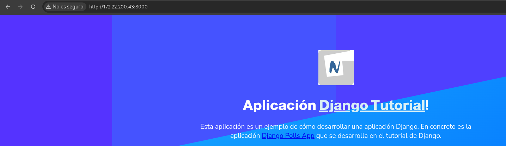
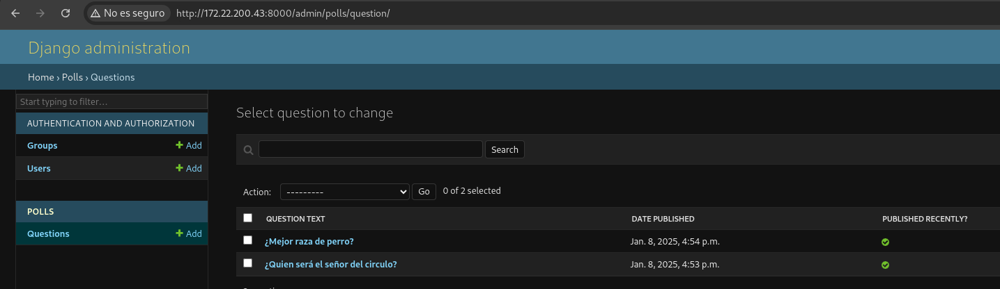
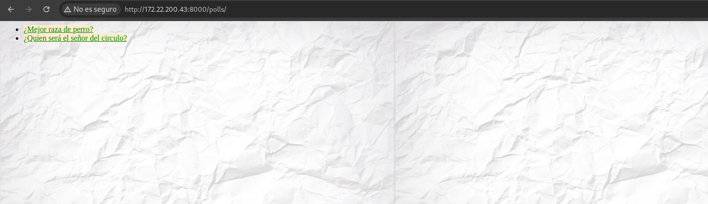
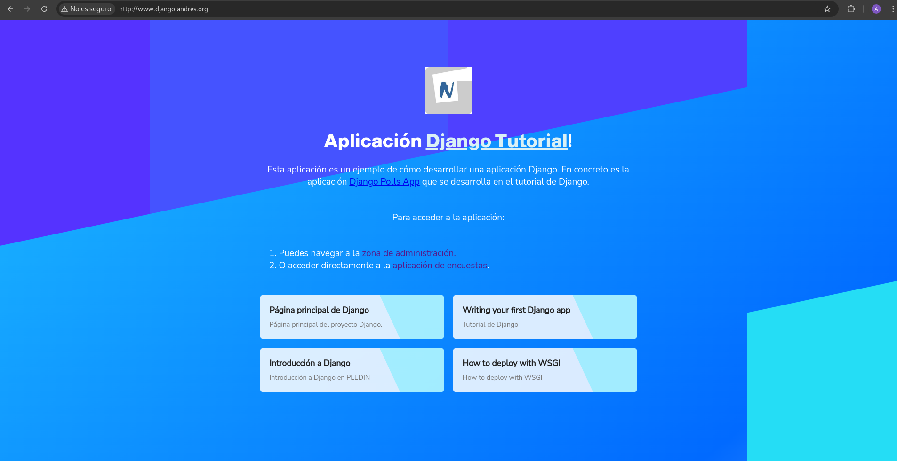
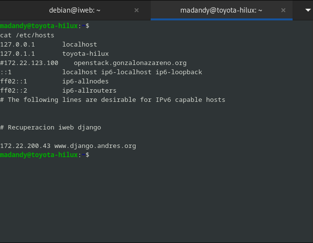
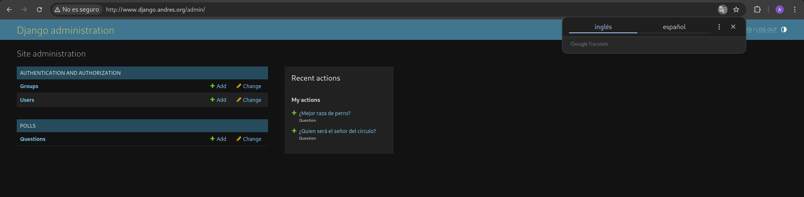
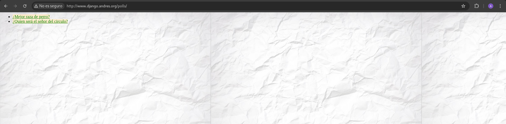

# Práctica: Instalación/migración de aplicaciones web Python

## Práctica 1 / 2: Despliegue de aplicaciones python

### Entorno de desarrollo

1. Clonamos el repositorio forkeado en nuestra máquina de OpenStack:

```
debian@iweb:~$ git clone https://github.com/madand1/django_tutorial.git
Cloning into 'django_tutorial'...
remote: Enumerating objects: 173, done.
remote: Counting objects: 100% (173/173), done.
remote: Compressing objects: 100% (104/104), done.
remote: Total 173 (delta 58), reused 148 (delta 53), pack-reused 0 (from 0)
Receiving objects: 100% (173/173), 4.26 MiB | 3.84 MiB/s, done.
Resolving deltas: 100% (58/58), done.
```

2. Creo un entorno virtual y lo activo

```
debian@iweb:~$ python3 -m venv venv
debian@iweb:~$ source venv/bin/activate
(venv) debian@iweb:~$
```

Y se veria tal que asi:

```
debian@iweb:~$ ls
django_tutorial  venv

```

3. Instalo las dependencias que estan en el fichero **requeriments.txt** de la siguiente manera:

```
(venv) debian@iweb:~/django_tutorial$ pip install -r requirements.txt
Collecting Django==4.2
Downloading Django-4.2-py3-none-any.whl (8.0 MB)
━━━━━━━━━━━━━━━━━━━━━━━━━━━━━━━━━━━━━━━━ 8.0/8.0 MB 11.9 MB/s eta 0:00:00
Collecting asgiref<4,>=3.6.0
Downloading asgiref-3.8.1-py3-none-any.whl (23 kB)
Collecting sqlparse>=0.3.1
Downloading sqlparse-0.5.2-py3-none-any.whl (44 kB)
━━━━━━━━━━━━━━━━━━━━━━━━━━━━━━━━━━━━━━━━ 44.4/44.4 kB 5.3 MB/s eta 0:00:00
Installing collected packages: sqlparse, asgiref, Django
Successfully installed Django-4.2 asgiref-3.8.1 sqlparse-0.5.2
```

4. CReo la base de datos a través del siguuente comando:

```
(venv) debian@iweb:~/django_tutorial$ python manage.py migrate
Operations to perform:
Apply all migrations: admin, auth, contenttypes, polls, sessions
Running migrations:
Applying contenttypes.0001_initial... OK
Applying auth.0001_initial... OK
Applying admin.0001_initial... OK
Applying admin.0002_logentry_remove_auto_add... OK
Applying admin.0003_logentry_add_action_flag_choices... OK
Applying contenttypes.0002_remove_content_type_name... OK
Applying auth.0002_alter_permission_name_max_length... OK
Applying auth.0003_alter_user_email_max_length... OK
Applying auth.0004_alter_user_username_opts... OK
Applying auth.0005_alter_user_last_login_null... OK
Applying auth.0006_require_contenttypes_0002... OK
Applying auth.0007_alter_validators_add_error_messages... OK
Applying auth.0008_alter_user_username_max_length... OK
Applying auth.0009_alter_user_last_name_max_length... OK
Applying auth.0010_alter_group_name_max_length... OK
Applying auth.0011_update_proxy_permissions... OK
Applying auth.0012_alter_user_first_name_max_length... OK
Applying polls.0001_initial... OK
Applying sessions.0001_initial... OK)
```

5. Creo el usuario administrador:

-  El usuario es **debian** contraseña **usuario**
```
(venv) debian@iweb:~/django_tutorial$ python manage.py createsuperuser
Username (leave blank to use 'debian'):
Email address:
Password:
Password (again):
The password is too similar to the username.
This password is too short. It must contain at least 8 characters.
Bypass password validation and create user anyway? [y/N]: y
Superuser created successfully.
```

6. Ejecuto el servidor de desarrollo:

- Pero antes de nada he ido a settings, que esta **aqui**, y he añadido el la linea ALLOWED_HOSTS, LO SIGUIENTE:

```
debian@iweb:~/django_tutorial/django_tutorial$ cat settings.py 
....
....
...
..
.
ALLOWED_HOSTS = ["172.22.200.43", "www.django.andres.org"]
...
...
..
..
.
```

Y ahora si lo activamos:


```
(venv) debian@iweb:~/django_tutorial$ python manage.py runserver 0.0.0.0:8000
Watching for file changes with StatReloader
Performing system checks...
System check identified no issues (0 silenced).
November 25, 2024 - 17:01:57
Django version 4.2, using settings 'django_tutorial.settings'
Starting development server at http://0.0.0.0:8000/
Quit the server with CONTROL-C.
```

Y como no lo vemos en la siguiente imagen:



8. Creo la spreguntas con sus respuestas en la siguiente:



9. Comprobamos que se han creado correctamente en la URL http://172.22.200.43:8000/polls:




10. Ahora instalo apache **fuera del entorno virtual** con el módulo **wsgi**

```
debian@iweb:~$ sudo apt install apache2 libapache2-mod-wsgi-py3
```

11. Creo el **virtualhost** he usado el alias paoara poder cargar las rutas donde se encunetran los archivos:

```
debian@iweb:~$ cat /etc/apache2/sites-available/django.conf 
<VirtualHost *:80>
    ServerName www.django.andres.org
    DocumentRoot /home/debian/django_tutorial/django_tutorial
    WSGIDaemonProcess django_tutorial python-path=/home/debian/django_tutorial python-home=/home/debian/venv
    WSGIProcessGroup django_tutorial
    WSGIScriptAlias / /home/debian/django_tutorial/django_tutorial/wsgi.py
    # Alias para los archivos estáticos de administración
    Alias /static/admin /home/debian/venv/lib/python3.11/site-packages/django/contrib/admin/static/admin
    <Directory /home/debian/venv/lib/python3.11/site-packages/django/contrib/admin/static/admin>
        Require all granted
    </Directory>
    # Alias para los archivos estáticos de "polls" 
    Alias /static/polls /home/debian/django_tutorial/polls/static/polls
    <Directory /home/debian/django_tutorial/polls/static/polls>
        Require all granted
    </Directory>
    <Directory /home/debian/django_tutorial>
        Options Indexes FollowSymLinks
        AllowOverride None
        Require all granted
    </Directory>
    ErrorLog ${APACHE_LOG_DIR}/error.log
    CustomLog ${APACHE_LOG_DIR}/access.log combined
</VirtualHost>

```

Antes de cargar nada de enlaces simbolicos he hecho esto:


- Permisos de archivo incorrectos:

```
chmod 664 /home/debian/django_tutorial/db.sqlite3
chown debian:www-data /home/debian/django_tutorial/db.sqlite3
```

- Permisos de directorio: 

```
chmod 775 /home/debian/django_tutorial
chown debian:www-data /home/debian/django_tutorial

```

12. Creamos el enlace simbólico del **virtualhost**, activamos el módulo **wsgi y reiniciamos apache** para guardar los cambios:

Todo esto es fuera del entorno virtual:

```
sudo a2ensite django.conf
sudo a2enmod wsgi
sudo systemctl restart apache2
```

13. Accedo a la URL que hemos inidcado en el virtaul hosts:



Y podemos acceder ya que en mi /etc/hosts en mi máquina anfitriona he puesto lo siguiente:




- Si pinchamos en la zona de administración veremos que podemos acceder y que tenemos el estilo de página cargado correctamente:


- Si pinchamos en la aplicación de encuestas podemos ver las preguntas que creamos y el estilo de página cargado correctamente:
